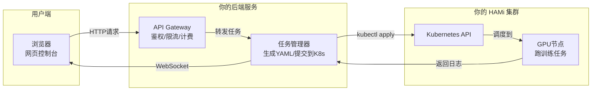
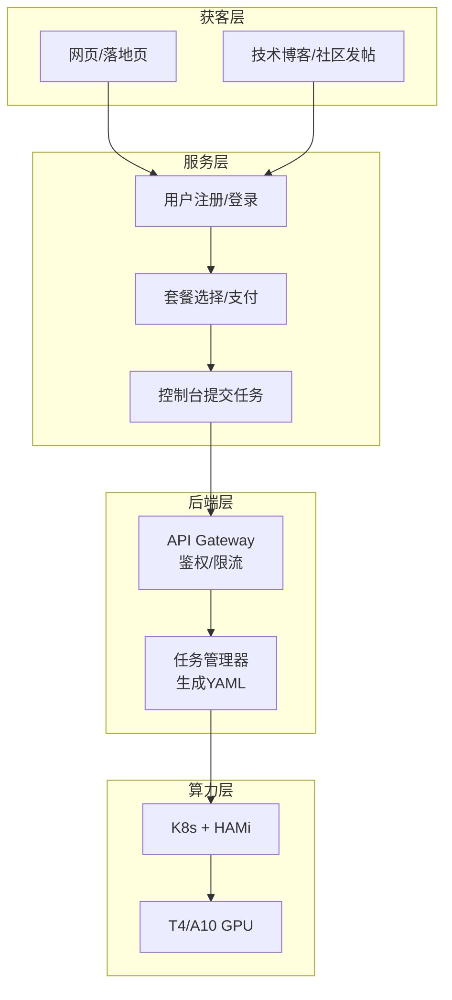

---

## 💰 一、赚钱的逻辑就一句话

**你替客户搞定“用GPU跑AI”这件事里所有麻烦的技术活，客户为此付你服务费。**

你**不是**靠“低价买进、高价卖出”GPU算力来赚钱。你赚的是**技术服务的钱**。

---

## 🔍 二、具体怎么操作？（一个完整的例子）

假设你有一个客户小明，他想训练一个AI模型，需要GPU。

### 情况A：小明自己干（不找你）
1. 去阿里云注册账号
2. 研究半天，买一台GPU云主机（比如T4卡，约1.2元/小时）
3. 登录服务器，装NVIDIA驱动、装CUDA、装Docker、装K8s、装HAMi……
4. 折腾两三天，可能还装不对
5. 终于能跑了，但每次提交任务都要写一堆YAML文件
6. 每个月还要自己盯着用了多少小时、有没有超预算

**小明的时间成本：** 2-3天折腾 + 持续的学习成本  
**小明的金钱成本：** 1.2元/小时 × 实际使用小时

### 情况B：小明找你（你的服务）
1. 小明跟你说：“我要用GPU跑模型”
2. 你说：“交给我，你只管写代码”
3. 你替他把上面所有“折腾”的事都做了
4. 小明只需要执行 `kubectl apply -f train.yaml` 就能跑任务
5. 月底你给他一个账单

**小明的收益：** 省了2-3天时间 + 不用学任何新东西  
**你的收费：** 每月800元（技术服务费）+ 算力成本（1.2元/小时实报实销）

---

## 📊 三、钱是怎么从客户口袋到你口袋的？

### 模式一：技术服务费 + 算力代付（推荐MVP）

这是最透明、风险最低的模式。

| 项目 | 金额 | 说明 |
| :--- | :--- | :--- |
| 客户付给你的钱 | 800元/月 + 算力费 | 每月固定服务费 + 实际GPU使用费 |
| 其中：技术服务费 | 800元 | **你赚的** |
| 其中：算力费 | 约300-900元 | 你代收代付给云厂商（约1.2元/小时） |
| 你的成本 | 约300-900元 | 你付给云厂商的算力费 |
| **你的净利润** | **800元/月** | 这就是你赚的 |

**举例**：小明这个月用了300小时GPU
- 小明付给你：800（服务费）+ 300×1.2（算力费）= 1160元
- 你付给云厂商：300×1.2 = 360元
- **你赚：800元**

> 关键点：小明也可以自己直接付钱给云厂商买算力，然后把服务器账号密码给你，你帮他装环境、做运维。这样你连“代付算力费”的环节都省了，**纯赚800元服务费**。

### 模式二：全包套餐（更简单，但你需要承担算力波动风险）

你把算力成本也包进去，给客户一个固定价格。

| 套餐 | 包含内容 | 客户月付 | 你的成本 | 你的利润 |
| :--- | :--- | :--- | :--- | :--- |
| 基础版 | 1个vGPU + 100小时/月 | 1200元 | 约800元 | **400元** |
| 标准版 | 2个vGPU + 300小时/月 | 2500元 | 约1600元 | **900元** |
| 专业版 | 4个vGPU + 500小时/月 | 4500元 | 约3000元 | **1500元** |

**风险**：如果客户用超了套餐包含的小时数，你的成本会上升，利润变薄。

---

## 🆚 四、对比：你为什么比云厂商“便宜”？

你可能觉得奇怪：云厂商自己也能卖GPU，凭什么客户要找你？

**因为你不是在卖算力，你是在卖“省心”。**

| 对比项 | 直接找云厂商 | 找你 |
| :--- | :--- | :--- |
| 价格 | 1.2元/小时 | 1.2元/小时（算力成本）+ 800元/月（服务费） |
| 学习成本 | 需要懂Linux、K8s、GPU驱动 | 0，你全包了 |
| 时间成本 | 2-3天搭建环境 | 0，开箱即用 |
| 多用户管理 | 需要自己搞 | 你做好了 |
| 监控告警 | 需要自己配 | 你做好了 |
| 技术支持 | 云厂商的工单（慢） | 你直接响应（快） |

**对于客户来说**：如果他的时间值钱（比如他是创业公司的CTO，或者正在赶论文的研究生），那么花800元/月买一个“不用操心环境”的服务，是非常划算的。

---

## 📈 五、你能赚多少？真实算账

### 成本端（你每个月要花的钱）

| 场景 | GPU成本 | 说明 |
| :--- | :--- | :--- |
| 只有1个客户，他用100小时/月 | 120元 | 1.2元 × 100小时 |
| 只有1个客户，他用300小时/月 | 360元 | 1.2元 × 300小时 |
| 有3个客户，每人用200小时/月 | 720元 | 1.2元 × 600小时 |
| 有5个客户，每人用300小时/月 | 1800元 | 1.2元 × 1500小时 |

### 收入端（你从客户那里收的钱）

| 客户数 | 技术服务费模式（800元/客户） | 全包套餐模式（平均1500元/客户） |
| :--- | :--- | :--- |
| 1个客户 | 800元 | 1500元 |
| 3个客户 | 2400元 | 4500元 |
| 5个客户 | 4000元 | 7500元 |

### 净利润（收入 - GPU成本）

| 客户数 | 技术服务费模式 | 全包套餐模式 |
| :--- | :--- | :--- |
| 1个客户（用300小时/月） | 800 - 360 = **440元** | 1500 - 360 = **1140元** |
| 3个客户（各用200小时/月） | 2400 - 720 = **1680元** | 4500 - 720 = **3780元** |
| 5个客户（各用300小时/月） | 4000 - 1800 = **2200元** | 7500 - 1800 = **5700元** |

---

## 🎯 六、一句话总结

**你赚钱的方式是：帮客户省掉“折腾GPU环境”的麻烦，客户为此付你服务费。**

- 你不需要有GPU硬件
- 你不需要低价买高价卖
- 你只需要会装系统、会配K8s、会用HAMi
- 然后找到一个愿意为“省心”付费的客户

**你的第一块钱**：找一个认识的有AI需求的朋友，跟他说：“我帮你把GPU环境全部配好，你只管跑代码，每个月你给我500块就行。”


**没有 HAMi，这个方案就不成立。**

让我解释一下为什么 HAMi 是这个模式的关键：

---

## 🔑 一、HAMi 解决了什么问题？

如果没有 HAMi，你租一台 T4 云主机，它是一张**完整的、独占的**显卡。

- 一个人用的时候，没问题
- 但你想同时卖给两个客户？**做不到**
- 你想限制客户 A 只能用 3GB 显存、客户 B 只能用 4GB 显存？**做不到**
- 你想保证客户 A 跑满不会影响客户 B？**做不到**

**没有 HAMi，你的一台 GPU 服务器一次只能服务一个客户。** 你的成本和收入是 1:1 的关系。

---

## 🚀 二、有了 HAMi 之后发生了什么？

HAMi 把一张物理 GPU **切成很多小份**：

| 物理 GPU | HAMi 切分后 | 你能卖给的客户数 |
| :--- | :--- | :--- |
| 1 张 T4（16GB 显存） | 4 个 4GB vGPU | 最多 4 个客户同时用 |
| 1 张 T4（100% 算力） | 2 个 50% 算力 vGPU | 2 个客户同时用 |

**关键变化**：
- 你的成本（租 1 张 T4）**不变**
- 你能服务的客户数 **翻了 2-4 倍**
- 你的收入 **翻了 2-4 倍**

---

## 💰 三、算一笔账：有 HAMi 和没有 HAMi 的区别

假设：租 1 张 T4，成本 1000 元/月，每个客户收 800 元/月

| 场景 | 能服务几个客户 | 月收入 | 月利润 |
| :--- | :--- | :--- | :--- |
| **没有 HAMi** | 1 个（独占整卡） | 800 元 | **亏 200 元** |
| **有 HAMi（切 2 份）** | 2 个（各 50% 算力） | 1600 元 | **赚 600 元** |
| **有 HAMi（切 4 份）** | 4 个（各 4GB 显存） | 3200 元 | **赚 2200 元** |

**结论**：没有 HAMi，你是在“倒卖算力”，利润极薄甚至亏损；有了 HAMi，你是在“提供共享算力服务”，**HAMi 是你的利润放大器**。

---

## 🎯 四、HAMi 还给了你什么？

除了“切分”能力，HAMi 还提供了这个商业模式必须的其他能力：

| 你需要的能力 | HAMi 提供 |
| :--- | :--- |
| 限制客户 A 只能用 3GB 显存 | ✅ `nvidia.com/gpumem: 3000` |
| 限制客户 B 只能用 50% 算力 | ✅ `nvidia.com/gpucores: 50` |
| 客户之间互相隔离，不干扰 | ✅ HAMi-Core 强制隔离 |
| 知道每个客户用了多少资源 | ✅ Prometheus + WebUI 监控 |
| 给不同客户不同的权限 | ✅ Kubernetes 命名空间 + HAMi 配额 |

**没有 HAMi，你需要自己实现所有这些能力**——那相当于你从零开始做一个 HAMi，不现实。

---

## 💡 五、所以你的商业模式本质是

```
你 = 云厂商（提供GPU） + HAMi（提供切分/隔离） + 你的服务（提供运维）
```

- **云厂商**：提供算力原材料
- **HAMi**：让你能把原材料“切碎”卖给多个人（**这是利润的核心**）
- **你**：把这一切打包成“开箱即用”的服务，收技术服务费

---

## ✅ 总结

**是的，HAMi 是这个方案的关键。**

- 没有 HAMi：你只能 1 台服务器卖 1 个客户，算上运维成本，可能还亏钱
- 有了 HAMi：你可以 1 台服务器卖 2-4 个客户，每个客户都付你服务费

**HAMi 是你的“利润放大器”**——它让你的固定成本不变，但收入可以翻倍。

你现在理解为什么这个方案能赚钱了吗？


写一个网页，用于介绍服务

---

## 🎯 一、你的网页核心价值主张

这个网页要告诉潜在客户的核心信息是：

> **“我不需要懂 Kubernetes、不需要装驱动、不需要配 HAMi。我只管写代码，你给我一个地方提交就行。”**

**你的卖点不是“我有 GPU”，而是“我把 GPU 环境的所有麻烦都替你搞定了”。**


## 🧩 二、网页的核心模块（MVP版本）

一个最简可行的网页只需要这 4 个页面：

| 页面 | 内容 | 目的 |
| :--- | :--- | :--- |
| **首页** | 一句话说清楚你是谁 + CTA按钮 | 让访客3秒内理解你的服务 |
| **定价页** | 套餐 + 价格 + 免费试用入口 | 促成转化 |
| **控制台** | 用户登录后的操作界面 | 客户实际使用的地方 |
| **文档页** | 如何提交任务、示例YAML | 降低客户使用门槛 |

### 首页核心文案示例

> **“一行命令，跑起你的 AI 训练”**
> 
> 不用折腾驱动、不用配 K8s、不用学 HAMi。
> 我们为你准备好了开箱即用的 GPU 环境。
> 
> [ 免费试用 ] [ 查看套餐 ]

### 控制台核心功能

用户登录后，他应该能看到：

1. **一个简单的提交表单**：粘贴代码 or 上传文件 → 选择 GPU 规格 → 点击运行
2. **任务列表**：正在运行的任务、历史任务、日志输出
3. **资源使用情况**：用了多少小时、还剩多少配额

**注意**：控制台的后端就是你的 HAMi 集群。用户提交任务 → 你生成 YAML → `kubectl apply` → 任务就跑起来了。


## 🛠️ 三、如何快速做出这个网页？（零代码/低代码方案）

你不需要从零写代码。2025-2026 年的 AI 工具已经可以帮你完成大部分工作。

### 方案一：AI 应用生成器（推荐，最省事）

现在有多个平台支持“一句话生成全栈应用”：

| 平台 | 特点 | 适用场景 |
| :--- | :--- | :--- |
| **阿里云 应用生成** | 自然语言生成 React/Vite 应用，支持一键部署到 ECS | 快速生成管理后台、控制台 |
| **AnyCoder** | 开源，支持多模态输入，可部署到 Hugging Face | 快速原型验证 |
| **Vercel v0** | 自然语言生成 React 组件，质量高 | 前端界面快速搭建 |

**操作步骤**（以阿里云应用生成为例）：

1. 登录阿里云控制台，找到“应用管理 - 应用生成”
2. 输入类似这样的需求描述：
   > “创建一个 GPU 算力租赁平台的控制台页面，包含用户登录、套餐选择、任务提交、任务列表展示功能。用户提交任务时可以选择 GPU 规格（1/2/4卡）、显存大小（4GB/8GB/16GB）。任务列表展示任务名称、状态、开始时间、运行时长。”
3. AI 自动生成完整项目代码（React + TypeScript + Tailwind）
4. 一键部署到云服务器

### 方案二：开源模板 + 修改

如果希望更多控制权，可以从现成的开源项目改起：

- **@grackle-ai/web**：一个开源的 AI 任务管理面板，支持任务树、环境管理、实时流式输出，技术栈是 React 19 + Vite + TypeScript
- 你可以 fork 这个项目，把后端对接改成你的 HAMi 集群

### 方案三：传统低代码平台

| 平台 | 优点 | 缺点 |
| :--- | :--- | :--- |
| **Bubble** | 完全无代码，快速搭建 | 不适合复杂后端逻辑 |
| **Retool** | 内部工具首选，对接 API 方便 | 面向企业内使用 |
| **Appsmith** | 开源，可自托管 | 需要一定前端基础 |

**我的建议**：方案一（AI 应用生成器）最适合你的 MVP 阶段——1-2 天就能跑通一个可用的控制台。


## 🏗️ 四、网页与 HAMi 集群的对接方式

这是最关键的技术环节。网页不能直接操作 K8s 集群（安全风险），需要一个后端服务做桥接。



### 后端服务需要做什么？

| 功能 | 实现方式 |
| :--- | :--- |
| **用户鉴权** | 简单的 JWT token，存用户信息和配额 |
| **任务提交** | 接收用户参数 → 生成 Pod YAML → 调用 K8s API 创建 |
| **任务列表** | 调用 K8s API 查询该用户的 Pod 列表 |
| **日志流式输出** | 用 WebSocket 或 `kubectl logs -f` 的方式实时返回 |
| **配额管理** | 在数据库记录每个用户的已用时长，超出则拒绝提交 |

### 这个后端服务怎么做？

**最简方案**：写一个 200 行左右的 Python Flask/FastAPI 服务：

```python
# 伪代码示例
@app.post("/api/submit")
def submit_task(user_id, gpu_spec, code):
    # 1. 检查用户配额
    if not check_quota(user_id):
        return {"error": "配额不足"}
    
    # 2. 生成 Pod YAML
    yaml = generate_pod_yaml(
        user_id=user_id,
        gpu_mem=gpu_spec["mem"],  # 如 4096
        gpu_cores=gpu_spec["cores"],  # 如 50
        code=code
    )
    
    # 3. 提交到 K8s
    kubectl.apply(yaml)
    
    # 4. 扣减配额
    deduct_quota(user_id)
    
    return {"task_id": task_id, "status": "running"}
```

你甚至可以用 Cursor、Copilot 或 Claude 直接生成这个后端服务的代码——把上面的需求描述喂给 AI，它就能生成一个可运行的版本。


## 📈 五、你的完整商业链路图



| 层级 | 你做的事 | 成本 |
| :--- | :--- | :--- |
| **获客层** | 做一个网页 + 写技术博客 | 几乎为零 |
| **服务层** | 用 AI 生成控制台 + 简单后端 | 几乎为零 |
| **后端层** | 写一个 200 行的 Python 服务 | 几乎为零 |
| **算力层** | 租 GPU 云主机 + 装 HAMi | 每月 800-1000 元 |

**你唯一的硬成本是 GPU 云主机**。网页、后端、控制台都可以用 AI 工具快速生成。


## ✅ 六、30 天完整启动清单

| 阶段 | 任务 | 工具/方法 | 时间 |
| :--- | :--- | :--- | :--- |
| **第1周** | 搭建 HAMi 集群 | 云主机 + K3s + Helm | 3-5 天 |
| **第2周** | 生成控制台网页 | 阿里云应用生成 / v0 / AnyCoder | 1-2 天 |
| **第2周** | 写后端 API 服务 | Cursor/Claude 生成 FastAPI 代码 | 1-2 天 |
| **第3周** | 网页 + 后端 + HAMi 联调 | 手动测试 | 2-3 天 |
| **第3周** | 配置支付 | 微信支付 / Stripe（先手动收款也行） | 1 天 |
| **第4周** | 找第一个种子用户 | 朋友圈 / V2EX / 技术群 | 持续 |

**现在就可以开始**：
1. 注册阿里云/腾讯云账号，领新用户优惠
2. 打开阿里云“应用生成”，输入你的需求描述
3. 1 小时后，你就有一个可用的控制台界面了

要不要我帮你把那个“200 行 Python 后端”的代码写出来？这样你就能直接用了。