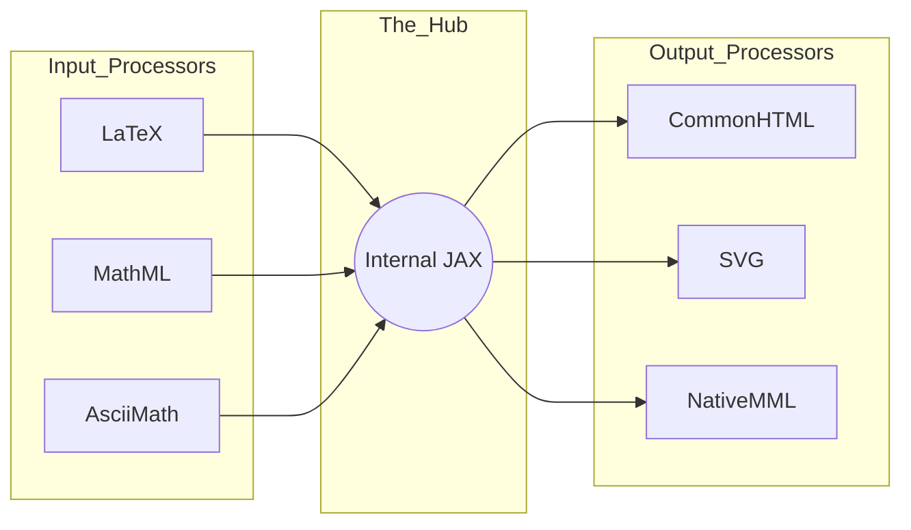

## 第一章：【破冰层】告别图片公式——Web 排版的美学革命

你好！我是你的技术领路人。在开启这段关于 **MathJax** 的深度探索之前，我想请你先回忆一下，在 2010 年以前，如果你在网页上看到一个复杂的积分公式 $\int_{-\infty}^{\infty} e^{-x^2} dx$ ，你通常会经历什么？

那时候，大多数网站采用的是最“原始”的方案：**截图**。

### 1.1 语义化的“坟墓”：图片公式的三宗罪

将数学公式存为图片（如 `.gif` 或 `.png`），在当时是无可奈何的选择，但它给现代 Web 开发留下了三个巨大的坑：

1.  **缩放失真（像素化）**：当你放大网页查看细节时，公式会变得模糊不清，充满了锯齿感。在视网膜（Retina）屏幕普及的今天，这种体验简直是灾难。
2.  **不可检索性**：如果你想在页面上搜索“$x^2$”，浏览器是搜不到图片的。对于学术数据库或技术文档来说，这意味着知识被封印在了像素里。
3.  **无障碍荒漠**：对于视障人士使用的读屏软件（Screen Reader）来说，一张图片就是一个黑盒。它无法读出“x 的平方”，只能无奈地跳过，或者读出无意义的文件名。

---

### 1.2 MathJax 的降临：公式的“同声传译”

MathJax 的出现，彻底改变了游戏规则。它不是一种新的数学语言，而是一个**高度智能的 JavaScript 显示引擎**。

你可以把它想象成一名精通多国语言的“同声传译员”：
* **输入端**：它听得懂 $\LaTeX$、MathML、AsciiMath 等各种“数学方言”。
* **输出端**：它能实时将这些方言翻译成浏览器看得懂、能缩放、可复制的精美 HTML 标签或 SVG 图形。

**这就好比从“看照片里的书”进化到了“直接阅读电子书”。** 公式不再是死的像素，而是活的、具有语义的 DOM 节点。

---

### 1.3 技术初心：从 $\TeX$ 的高塔到 Web 的平原

在学术界，$\TeX$（由计算机大神高德纳 Knuth 开发）是数学排版的上帝准则。但在 Web 早期，浏览器根本无法原生解析 $\TeX$。

MathJax 的核心使命就是：**在不要求用户安装任何插件、不要求浏览器做任何原生更改的前提下，把最顶级的排版能力带到浏览器里。**

| 维度 | 图片公式 (Traditional) | MathJax 渲染 (Modern) |
| :--- | :--- | :--- |
| **清晰度** | 随缩放变模糊 | 无损矢量，永远清晰 |
| **交互性** | 无法选中，无法复制 | 可直接复制为 $\LaTeX$ 代码 |
| **加载方式** | 每个公式一个 HTTP 请求 | 一个 JS 库，全页代码渲染 |
| **SEO 友好度** | 极低 | 极高（爬虫可理解公式逻辑） |
| **视觉一致性** | 取决于截图工具 | 自动匹配页面的字体大小和颜色 |

---

### 1.4 为什么它被称为“工业标准”？

如果你去观察维基百科（Wikipedia）、Stack Overflow、甚至是各种科研期刊的官网，你会发现它们不约而同地选择了 MathJax。

这种选择背后不仅仅是因为美观，更是因为 MathJax 赋予了数学公式**“尊严”**。它确保了无论是科学家的严谨推导，还是工程师的架构笔记，都能以最准确、最优雅的形式跨越设备和浏览器的鸿沟。

---

### 1.5 避坑锦囊：不要为了几个符号加载“重型大炮”

> **【避坑锦囊】**：
> MathJax 是一个非常强大的引擎，但它的体积相对较大（尤其是 2.x 版本）。如果你的网页只是偶尔出现一两个简单的根号（如 $\sqrt{x}$），直接使用 HTML 实体或简单的 CSS 样式可能更轻量。
> 
> **原则**：只有当你需要处理复杂的矩阵、多行等式或追求极致的学术排版时，才开启 MathJax。**切忌杀鸡用牛刀，导致页面加载性能下降。**

---

**第一章结束。** 我们已经理解了 MathJax 如何终结“图片公式”的黑暗时代。
**接下来，我们将进入 Level 2（内功层），拆解这个庞大的 JS 引擎内部是如何进行分层解析和渲染的。**


## 第二章：【内功层】渲染的艺术——从符号到像素的转换引擎

欢迎来到 MathJax 的核心实验场。如果说第一章是关于“为什么”的宏观叙事，那么这一章我们将拆解“怎么做”的微观架构。

作为一个复杂的渲染引擎，MathJax 并不是简单地把文本替换成 HTML。它内部运行着一套极其精密的**三段式流水线**。我们将通过这套流水线，理解一个 $\LaTeX$ 字符串是如何在毫秒间变身为精美公式的。

---

### 2.1 渲染三部曲：Input → Hub → Output

MathJax 的架构设计遵循了经典的“编译器”模型，解耦了**输入格式**与**输出表现**。



1.  **Input Processor (输入处理器)**：
    它像是一个翻译官，负责识别页面上的特定标识符（如 `$...$`）。它会将这些原始字符串解析成一种中间格式——**内部 MathML (Internal JAX)**。
2.  **The Hub (中央枢纽)**：
    这是 MathJax 的大脑。它负责协调所有的处理过程，管理配置项，并决定什么时候该扫描 DOM，什么时候该触发重绘。
3.  **Output Processor (输出处理器)**：
    它负责将中间格式转化为最终的浏览器视觉表现。无论你想要高度兼容的 HTML+CSS，还是极其锐利的 SVG 矢量图，都由这一层决定。

---

### 2.2 核心数据结构：语义树 (MML Tree)

当 MathJax 看到 `x^2 + y^2` 时，它并不是在做字符串替换，而是在内存中构建了一棵**语义树**。

* **根节点**：加法运算 (`+`)
* **左子树**：幂运算 (`^`)，底数为 `x`，指数为 `2`
* **右子树**：幂运算 (`^`)，底数为 `y`，指数为 `2`

**为什么要多此一举？** 因为只有理解了数学逻辑，MathJax 才能处理复杂的排版细节。例如，当底数变高时，根号 $\sqrt{\frac{a}{b}}$ 的横线应该自动拉长并抬高。如果没有这棵语义树，公式就会像拼凑的积木一样摇摇欲坠。

---

### 2.3 Web Fonts 的魔法：为什么符号不乱码？

你是否好奇过，为什么 MathJax 的积分号 $\int$ 无论怎么放大都那么圆润？

MathJax 自带了一套非常庞大的 **Web Fonts**。这些字体不是普通的 Arial 或 Times New Roman，而是专门为数学设计的（如 Computer Modern）。
* **字符拼接**：对于超大的括号或积分号，MathJax 会利用字库中的“片段”进行动态拼接。
* **零位偏移**：它通过精确的 CSS 偏移量，确保上下标（Subscript/Superscript）在垂直方向上的位置完美符合排版规范。

---

### 2.4 渲染模式大比拼：SVG vs. CommonHTML

作为架构师，你需要根据业务场景在两种主流输出模式间做出选择：

| 特性 | SVG 模式 | CommonHTML 模式 |
| :--- | :--- | :--- |
| **渲染原理** | 每一个公式都是一个独立的 `<svg>` 标签 | 使用标准的 HTML 标签 + 复杂的 CSS |
| **视觉效果** | 极致锐利，缩放绝不失真 | 贴近网页原生文字感 |
| **性能开销** | DOM 节点相对较少 | 可能会产生大量嵌套的 `<span>` |
| **交互性** | 较难直接通过 CSS 修改部分颜色 | 非常容易通过 CSS 进行样式定制 |
| **推荐场景** | 移动端预览、离线生成的静态文档 | 交互式教育平台、公式密集的长文 |

---

### 2.5 状态机：扫描与替换的艺术

MathJax 的运行是一个异步过程。它会先扫描页面的文本节点，找到匹配项后，将其暂时隐藏（防止页面跳动），进入后台排版计算，最后再将生成的 DOM 节点一次性回填。这个过程涉及到一个复杂的**排队机制 (Signal Queue)**，确保多个公式渲染不会导致浏览器假死。

---

### 2.6 避坑锦囊：小心“公式闪烁” (FOUT)

> **【避坑锦囊】**：
> 在页面加载初期的 0.5 秒内，用户可能会先看到原始的 `$\sum_{i=1}^n$` 文本，然后才突然变成漂亮的公式。这被称为 **Flash of Unformatted Text (FOUT)**。
> 
> **架构对策**：
> 在 CSS 中先给包含公式的容器设置 `visibility: hidden;`，并利用 MathJax 的 `typesetPromise()`。当渲染完成后，再通过回调函数将容器显示出来。**优雅的加载比快速的错误显示更重要。**

---

**第二章结束。** 我们已经拆解了 MathJax 的内部渲染引擎。
**接下来，我们将进入 Level 3（实战层），看看如何在中后台项目（React/Vue）中高性能地集成 MathJax，并处理动态内容的渲染难题。**


## 第三章：【实战层】丝滑集成——工业级前端配置与动态渲染

欢迎来到代码一线。作为架构师，我们深知“Demo 容易，工程难”。在这一章，我们将探讨如何在现代单页应用（SPA）中驯服 MathJax，确保它在 React、Vue 或异步加载内容的场景下依然稳如泰山。

---

### 3.1 工业级集成：全局配置的艺术

在生产环境中，你绝不应该使用默认配置。MathJax 3.x 引入了基于 `window.MathJax` 的配置对象，必须在加载脚本**之前**完成定义。

#### 基础范式：React 中的安全集成
```javascript
// 在项目的入口文件或 HTML 模板中
window.MathJax = {
  tex: {
    inlineMath: [['$', '$'], ['\\(', '\\)']], // 支持 $...$ 这种行内公式
    displayMath: [['$$', '$$'], ['\\[', '\\]']],
    processEscapes: true
  },
  options: {
    skipHtmlTags: ['script', 'noscript', 'style', 'textarea', 'pre'], // 避开代码块
    ignoreHtmlClass: 'tex2jax_ignore', // 忽略特定区域
  },
  startup: {
    ready: () => {
      console.log('MathJax 准备就绪!');
      MathJax.startup.defaultReady();
    }
  }
};
```

---

### 3.2 动态内容的“再渲染”难题

在单页应用中，数据通常是通过 API 异步获取的。如果你在组件挂载后通过 `innerHTML` 注入了一段包含 $\LaTeX$ 的文本，MathJax 是不会自动去渲染它的。这时，你需要手动触发** typesetting（排版）**。

#### 核心 API：`MathJax.typesetPromise()`
这是一个返回 Promise 的异步操作，确保了排版过程不会阻塞 UI 的连续更新。

**Vue 组件实战演示：**
```javascript
export default {
  props: ['content'],
  watch: {
    content() {
      this.$nextTick(() => {
        if (window.MathJax && window.MathJax.typesetPromise) {
          // 只渲染当前组件作用域内的公式，避免全局重扫
          window.MathJax.typesetPromise([this.$el]).catch((err) => {
            console.error("排版失败:", err);
          });
        }
      });
    }
  }
}
```

---

### 3.3 参数调优：性能与兼容性的平衡

为了提升工业级应用的响应速度，我们需要针对以下关键参数进行精细化调整：

| 参数 | 建议值 | 架构意图 |
| :--- | :--- | :--- |
| **`processRefs`** | `false` | 如果没有复杂的公式编号引用，禁用它可以减少解析时间。 |
| **`fontURL`** | CDN 地址 | 将 2MB+ 的字体文件放在高速 CDN 上，降低服务器负载。 |
| **`output` 选型** | `chtml` | 在桌面端建议使用 CommonHTML，它对屏幕阅读器的兼容性最好。 |
| **`compileError`** | 自定义函数 | 当公式写错时（如 `$\frac{1}{$`），显示红色的占位符而非直接崩溃。 |

---

### 3.4 避坑锦囊：金额符号与美元符的战争

> **【避坑锦囊】**：
> 这是一个经典血案。如果你的页面上写着 `本月收入 $100，支出 $50`，MathJax 会兴奋地把 `100，支出` 当成一段 $\LaTeX$ 公式进行渲染，导致页面文字乱码。
> 
> **架构对策**：
> 1. **强制转义**：告知编辑人员使用 `\$` 来表示货币。
> 2. **类名隔离**：通过 `ignoreHtmlClass` 配置项，将非数学内容的容器全部标记为 `tex2jax_ignore`。
> 3. **精准匹配**：在配置中将 `inlineMath` 设置为更复杂的标识符，如 `['\\(', '\\)']`，彻底弃用单 `$` 符号。

---

### 3.5 流程化伪代码：前端公式渲染管线

```text
PIPELINE Formula_Renderer(DOM_Node):
    STEP 1: 检查 window.MathJax 是否存在 -> 若无，记录错误并跳过
    STEP 2: 锁定 DOM 区域，防止浏览器重排 (Reflow)
    STEP 3: 调用 MathJax.typesetClear([DOM_Node]) -> 清除旧的缓存
    STEP 4: 执行 typesetPromise([DOM_Node])
    STEP 5: 成功后，添加 'math-rendered' CSS 类名触发淡入动画
    STEP 6: 监控节点变化 (MutationObserver)，自动化处理后续更新
```

---

**第三章结束。** 我们已经掌握了在实战中如何稳定、动态地渲染公式。
**接下来，我们将进入 Level 4（架构层），探讨在海量公式或千万级访问量下，如何通过服务端预渲染（SSR）来突破浏览器的性能红线。**


## 第四章：【架构层】性能的红线——海量公式下的渲染瓶颈

当你构建一个简单的博客时，MathJax 就像是一个轻便的插件；但如果你是在构建一个拥有数万道题目的题库系统，或者是一篇包含上千个公式的超长学术论文，MathJax 就会变成一个极其沉重的“性能枷锁”。在这一章，我们将探讨如何在高负载场景下进行架构突围。

---

### 4.1 性能杀手：为什么你的页面会卡顿？

在架构视角下，MathJax 的性能消耗主要来自两个维度：
1. **CPU 密集型的解析**：将 $\LaTeX$ 字符串解析为语义树（MML Tree）并计算排版位置是一个复杂的递归过程。在移动端或低配设备上，这会导致浏览器主线程出现明显的“掉帧”。
2. **DOM 节点爆炸**：
    * **CommonHTML 模式**下，一个简单的分式 $\frac{a}{b}$ 可能会产生 10 多个嵌套的 `<span>` 标签。
    * 如果页面有 1000 个公式，DOM 节点的数量会瞬间增加数万个，直接导致滚动卡顿和内存溢出。

---

### 4.2 架构破局：服务端预渲染 (SSR)

为了让用户在打开页面的瞬间就能看到精美的公式，而不必等待 JS 引擎缓慢扫描，我们通常采用 **MathJax-node** 方案在后端完成“重活”。

#### 核心思想：空间换时间
在数据入库或构建静态页面阶段，直接将 $\LaTeX$ 转换成 **SVG 字符串**。

**Node.js 服务端预处理流程：**
```javascript
const mj = require('mathjax-node');

mj.typeset({
  math: "E = mc^2",
  format: "TeX",
  svg: true, // 直接输出 SVG 路径数据
}, function (data) {
  if (!data.errors) {
    // 将生成的 <svg> 直接存入数据库或嵌入 HTML
    console.log(data.svg); 
  }
});
```
**结果**：浏览器收到的只是普通的 SVG 图片代码。它不需要加载 2MB 的 MathJax 核心库，也不需要运行任何解析逻辑，渲染速度提升了 **10 倍**以上。

---

### 4.3 渲染策略对比：CSR vs SSR vs 混合模式

| 策略 | 客户端渲染 (CSR) | 服务端渲染 (SSR) | 混合模式 (Hybrid) |
| :--- | :--- | :--- | :--- |
| **首屏速度** | 较慢（等待 JS 加载） | **极快** | 快 |
| **交互能力** | 强（支持动态公式） | 弱（图片不可交互） | 强（按需激活） |
| **服务器成本** | 极低 | **高**（CPU 消耗大） | 中 |
| **适用场景** | 评论区、个人博客 | **静态题库、百科、电子书** | 交互式在线教育 |

---

### 4.4 架构优化锦囊：按需加载与虚拟滚动

如果你必须在前端处理海量公式，请务必实施以下三层防御：

1. **分片渲染 (Chunking)**：
   不要一次性将整个文档交给 MathJax。使用 `setTimeout` 或 `requestIdleCallback` 将公式拆分成 20 个一组进行排队渲染，确保用户在渲染期间依然能平滑滚动。
2. **虚拟滚动集成**：
   对于长列表，只渲染可视区域内的公式。当公式滚出视野时，及时清理相关的 DOM 节点以释放内存。
3. **Lazy Loading 字体**：
   配置 MathJax 仅在检测到特定数学符号时才加载对应的字体子集。

---

### 4.5 避坑锦囊：警惕“排版回流” (Layout Thrashing)

> **【避坑锦囊】**：
> MathJax 在渲染时会反复读取元素的 `offsetHeight` 来计算位置。如果在循环中不断执行“读取高度 -> 修改样式”，会导致浏览器陷入频繁的**重排（Reflow）**。
> 
> **架构对策**：
> 确保批量调用 `MathJax.typesetPromise([node1, node2...])`。将所有需要渲染的节点一次性传给引擎，让 MathJax 在内部进行统一的读取和写入优化。

---

**第四章结束。** 我们已经通过 SSR 和分片策略攻克了性能堡垒。
**接下来，我们将进入 Level 5（升维层），对比 MathJax 的最强对手 KaTeX，并讨论 AI 时代下公式交互的未来趋势。**


## 第五章：【升维层】超越显示——可交互数学与 AI 时代的公式

欢迎来到本次技术专栏的终章。作为架构师，我们不能只满足于“显示正确”。在前端性能竞争白热化和 AI 模型重塑交互逻辑的今天，MathJax 正在从一个“渲染引擎”演变为一个“数学底座”。

这一章，我们将探讨 MathJax 的局限、它的最强对手，以及在 AI 浪潮下，数学公式如何实现“活化”。

---

### 5.1 巅峰对决：MathJax vs. KaTeX

在高性能 Web 开发领域，你一定听过 **KaTeX**。它是 Khan Academy 开发的后起之秀，以“快”著称。

| 特性 | MathJax (v3) | KaTeX |
| :--- | :--- | :--- |
| **渲染速度** | 较快（异步架构） | **极快（同步渲染，性能之王）** |
| **功能完备性** | **教科书级全覆盖（含宏定义、复杂矩阵）** | 覆盖常用 90% 的 LaTeX 语法 |
| **包体积** | 较重 (数百 KB ~ 2MB) | **极轻 (约 100KB)** |
| **易用性** | 自动扫描 DOM，配置丰富 | 需手动调用渲染函数 |
| **结论** | **学术出版、长篇论文、复杂排版首选** | **移动端、IM 聊天、高性能交互首选** |

**架构建议：** 如果你的系统只需要显示简单的二元一次方程，选 KaTeX；如果你要写一本像《算法导论》那样充满各种自定义宏和古怪符号的书，MathJax 是唯一的救赎。

---

### 5.2 语义化未来：从“好看”到“好懂”

MathJax 3.0 的一个伟大升维是增强了 **无障碍（Accessibility）**。
它不仅渲染视觉符号，还会生成隐藏的 **MathML** 结构。这意味着 AI 代理（如 GPT-4o 或 Claude）在爬取你的网页时，不再是猜测 `x^2` 的意思，而是能通过语义树精确理解公式的逻辑。

这种“语义化”也催生了 **可交互公式**：
* **动态调参**：点击公式中的变量 $a$，拖动滑块，旁边的函数图像实时变化。
* **分步推导**：点击等号，自动展开下一步的推导逻辑。

---

### 5.3 AI 时代的集成：从图片到 LaTeX 的闭环

随着视觉大模型的崛起，MathJax 迎来了一个爆发式的应用场景：**公式 OCR 还原**。

1. **输入端**：用户拍一张手写的数学卷子。
2. **中间层**：AI 模型（如 Mathpix 或开源的 LaTeX-OCR）提取文字并转化为 $\LaTeX$ 代码。
3. **输出端**：MathJax 接收代码，在网页上瞬时还原成可编辑、可搜索的完美排版。

作为架构师，你可以利用这一链路，构建一个**从拍照到自动批改**的完整教育闭环。

---

### 5.4 避坑锦囊：警惕“版本断层”

> **【避坑锦囊】**：
> MathJax 2.x 和 3.x 几乎是两个完全不同的软件。3.x 移除了 2.x 中许多老旧的配置项，且 API 不向下兼容。
> **架构对策**：如果你的老项目依赖于复杂的自定义扩展（Extensions），**千万不要盲目升级**。如果新开项目，**坚决不要使用 2.x**。3.x 的异步 Promise 架构才是现代 Web 开发的基石。

---

### 🏛️ 全文总结：公式是 Web 的诗

从第一章的“图片公式三宗罪”，到第五章的“AI 闭环”，我们一起走过了 MathJax 的万字深度之旅。

**总结我们的架构认知：**
* **Level 1**：MathJax 赋予了公式在 Web 上的语义尊严。
* **Level 2**：解析、中枢、输出的三段式架构是其灵活的源泉。
* **Level 3**：动态内容的 `typesetPromise` 是 SPA 集成的核心。
* **Level 4**：海量数据下的 SSR 和分片渲染是性能的生死线。
* **Level 5**：根据业务复杂度和性能要求，在 MathJax 与 KaTeX 之间进行冷静权衡。

数学是上帝书写宇宙的语言，而 MathJax 是我们作为技术工作者，在屏幕上复刻这份神圣语言的最佳画笔。

---

**本专栏全文完。** 感谢你的长久陪伴。希望这万字长文能成为你技术架构工具箱里，最锋利的那把刻度尺。

如有更多关于前端排版或数学渲染的问题，欢迎随时“开卷”探讨！