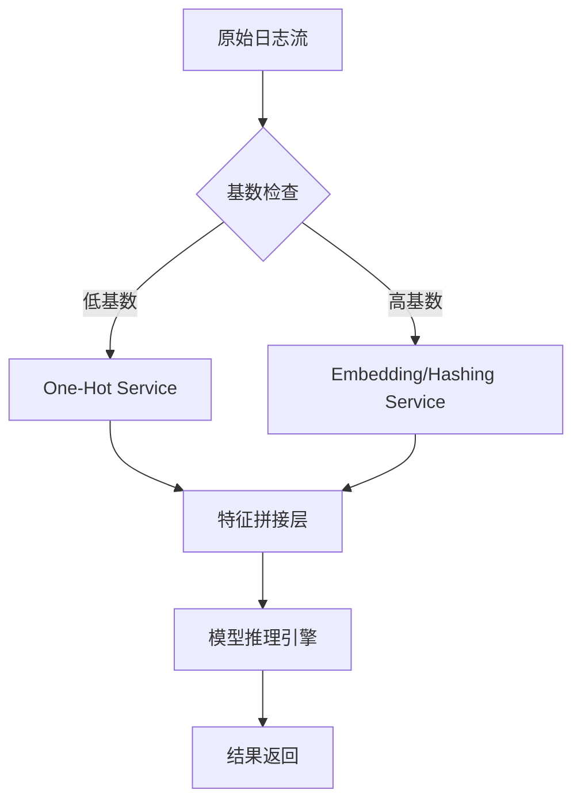
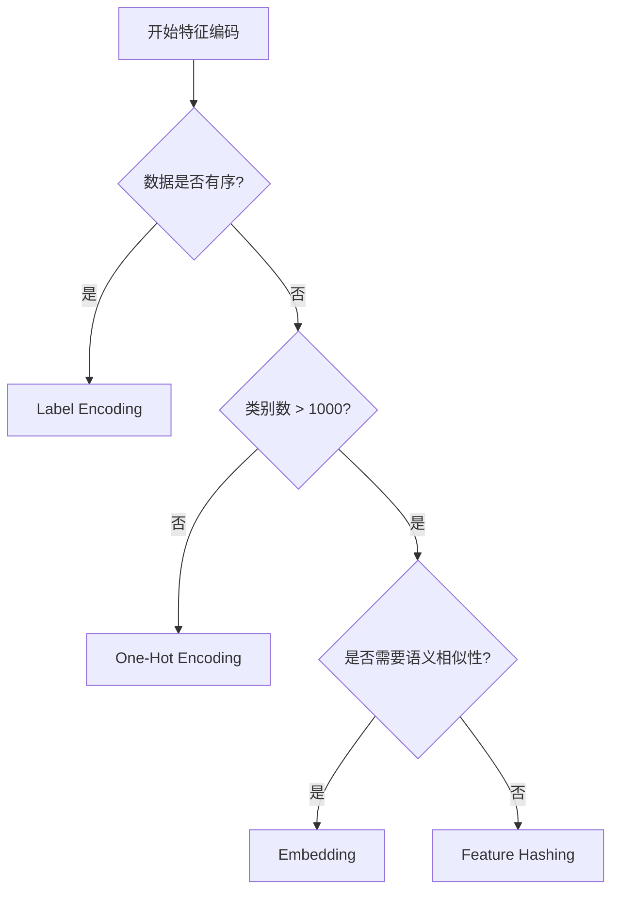

## 第一章：【破冰层】非此即彼的艺术——为什么机器看不懂“苹果”？

你好！我是你的技术领路人。在进入深奥的算法和架构之前，我想请你先暂时忘掉你是一个程序员，我们一起走进一个生活中的平凡场景。

### 1.1 消失的“中间地带”：点餐单里的哲学

想象一下，你正在经营一家只有三种水果提供的果汁店：**苹果**、**香蕉**、**西瓜**。

如果你要给后厨传达订单，最简单的方式是什么？你可能会在纸上写下数字：
* 1 代表苹果
* 2 代表香蕉
* 3 代表西瓜

这种做法在人类看来非常直观，但在计算机的“大脑”里，这却是一场灾难的开始。为什么？因为计算机天生具备“计算”属性。

当你告诉计算机“苹果是 1，香蕉是 2”时，它会不自觉地运行它那套冰冷的逻辑：$1 + 1 = 2$。在它看来，**“两个苹果相加等于一个香蕉”**。更糟糕的是，它会认为 $1 < 2 < 3$，即**“西瓜比香蕉大，香蕉比苹果大”**。

但事实是，水果之间只有**种类**的不同，没有**大小**或**顺序**的逻辑。这种因为随意数字化而引入的“伪序关系”（Pseudo-ordinal Relationship），就是我们需要 One-Hot 编码（独热编码）的根本原因。

---

### 1.2 什么是 One-Hot：那一盏唯一的灯

为了消除这种错误的关联，我们决定换一种记录方式。我们不再给水果打分，而是设计一个“开关面板”。

面板上有三个开关，分别贴着“苹果”、“香蕉”和“西瓜”的标签。
* 当你点**苹果**时，只有第一个开关打开，其他全关：`[1, 0, 0]`
* 当你点**香蕉**时，只有第二个开关打开，其他全关：`[0, 1, 0]`
* 当你点**西瓜**时，只有第三个开关打开，其他全关：`[0, 0, 1]`

**这就是 One-Hot 编码的精髓：在任意时刻，状态向量中只有一位是有效的（Hot），其余全部为零（Cold）。**

---

### 1.3 为什么要如此“浪费”空间？

初学者常会问：我明明可以用一个数字表示 100 种水果，为什么非要用一个长度为 100 的数组，里面装 99 个 0 呢？这不是极大的浪费吗？

我们可以通过下面这个对比表来直观感受两者的差异：

| 特性 | 标签编码 (Label Encoding) | 独热编码 (One-Hot Encoding) |
| :--- | :--- | :--- |
| **存储方式** | 单个数值（1, 2, 3...） | 长度为 N 的位阵列（[1,0,0]...） |
| **语义含义** | 隐含顺序和大小关系 | 类别之间完全独立、正交 |
| **适用场景** | 有序分类（如：衣服尺寸 S/M/L） | 无序分类（如：城市、颜色、性别） |
| **对模型的影响** | 容易误导线性模型产生偏见 | 增加特征维度，但保证了语义纯净 |
| **计算复杂度** | 低 | 随类别数量（基数）爆炸式增长 |

**核心价值：** One-Hot 编码剥离了分类数据之间不该存在的“数量逻辑”，赋予了每个类别平等的地位。它像是一把手术刀，精准地切断了“苹果”与“香蕉”之间那条不存在的数学连线。

---

### 1.4 深度学习的“入场券”

在现代 AI 架构中，One-Hot 不仅仅是一种数据转换，它是机器感知世界的“第一道防线”。

无论是神经网络还是逻辑回归，它们本质上都在做矩阵运算（点积、加法）。如果我们给城市编码为 `北京=1, 上海=2, 广州=3`，模型在计算权重时就会倾向于给“广州”分配更高的数值权重，仅仅因为它被分配到的数字大。

使用 One-Hot 之后，城市变成了高维空间里的几个互相垂直的坐标轴点。这种**正交性**确保了模型在学习“北京”的特征时，绝不会干扰到对“上海”的判断。

---

### 1.5 避坑锦囊：别在“有序数据”上乱用 One-Hot

> **【避坑锦囊】**：
> 并不是所有的文本分类都要用 One-Hot。如果你的数据具有天然的梯度逻辑，例如：
> * **教育程度**：高中(1)、本科(2)、硕士(3)、博士(4)
> * **用户等级**：青铜(1)、白银(2)、黄金(3)
> 
> 在这种情况下，使用 Label Encoding 反而能帮助模型捕捉到“博士比高中生受教育程度更高”这一有用的趋势。**记住：当你试图消除类别间的联系时，也可能不小心杀死了数据中的金子。**

---

**第一章结束。** 我们已经建立起了对 One-Hot 编码的直觉认知。
**接下来，我们将进入 Level 2（内功层），从几何模型和数学正交性的角度，拆解它是如何重塑多维空间的。**


## 第二章：【内功层】正交空间的坐标——单位矢量的几何逻辑

欢迎来到“内功修炼场”。在上一章中，我们通过“开关面板”建立了直觉。但作为一名架构师，我们不能止步于表象。这一章，我们将深入数学的底层，看看 One-Hot 是如何通过构建**标准正交基**，在大数据和模型计算中发挥核心作用的。

---

### 2.1 几何模型：构建一个互不干涉的维度

在数学上，One-Hot 编码本质上是将每一个分类特征投射到一个**高维空间**中。

假设我们有三个类别：`[红色, 绿色, 蓝色]`。在 One-Hot 的世界里，这不再是一个维度上的三个点，而是**三维空间中的三个坐标轴单位向量**：
* **红色**：$\vec{v}_1 = (1, 0, 0)$
* **绿色**：$\vec{v}_2 = (0, 1, 0)$
* **蓝色**：$\vec{v}_3 = (0, 0, 1)$

#### 为什么这种“正交性”至关重要？
在几何学中，两个向量如果垂直（正交），它们的**点积（Dot Product）必为 0**。

$\vec{v}_1 \cdot \vec{v}_2 = (1 \times 0) + (0 \times 1) + (0 \times 0) = 0$

**这意味着什么？** 意味着在模型的计算过程中，特征之间是**完全独立**的。当我们调整“红色”对应的权重时，由于点积为 0，这个调整过程在数学上完全不会影响到“绿色”或“蓝色”的得分。这种特性为线性模型提供了极佳的解耦能力。

---

### 2.2 汉明距离：分类世界的“公平尺”

在机器学习中，我们经常需要计算两个样本之间的“距离”。

如果你使用 Label Encoding（红=1, 绿=2, 蓝=3），计算欧几里得距离时：
* 红色到绿色的距离是 $\left|1 - 2\right| = 1$
* 红色到蓝色的距离是 $\left|1 - 3\right| = 2$

模型会错误地认为：**红色和绿色比红色和蓝色更相似**。这显然是荒谬的。

而使用 One-Hot 编码后，我们引入了**汉明距离（Hamming Distance）**的概念。对于任意两个不同的 One-Hot 向量，它们之间的曼哈顿距离永远是 $2$，欧几里得距离永远是 $\sqrt{2}$。

| 类别对比 | 向量 A | 向量 B | 汉明距离 | 结论 |
| :--- | :--- | :--- | :--- | :--- |
| **红 vs 绿** | `[1, 0, 0]` | `[0, 1, 0]` | 2 | 等距 |
| **红 vs 蓝** | `[1, 0, 0]` | `[0, 0, 1]` | 2 | 等距 |
| **绿 vs 蓝** | `[0, 1, 0]` | `[0, 0, 1]` | 2 | 等距 |

**这就是 One-Hot 的数学正义：它强行抹平了所有类别间的差异，让它们在特征空间中保持绝对的等距。**

---

### 2.3 状态机描述：从原始数据到独热阵列

从工程逻辑上看，One-Hot 的转换过程可以用一个简单的**确定有限状态自动机（DFA）**或处理流来描述。

```mermaid
graph LR
    A[输入原始特征] --> B{查表检索}
    B -- 命中索引 i --> C[初始化全0向量 V]
    C --> D[将 V[i] 置为 1]
    D --> E[输出 One-Hot 向量]
    B -- 未命中 --> F[处理 Unknown 情况]
```

在这个过程中，最核心的内功在于**词表（Vocabulary）的维护**。词表决定了向量的长度 $N$。如果你的词表动态增长，你的整个特征矩阵维度就会随之变动，这在生产环境中是极其危险的。

---

### 2.4 稀疏矩阵：被“0”填满的宇宙

当类别数量 $N$ 变得很大时（例如 10,000 个城市），一个样本的特征向量就会变成：
`[0, 0, 0, ..., 1, ..., 0, 0]`

这在计算机内存中被称为**稀疏矩阵（Sparse Matrix）**。
* **逻辑效率**：虽然它看起来很占空间，但由于只有一位是 1，我们在进行矩阵乘法 $Y = WX$ 时，实际上根本不需要做乘法，只需要根据 1 的位置进行一次**查表取值（Indexing）**即可。
* **存储挑战**：如果直接以稠密数组（Dense Array）存储，内存消耗将以 $O(BatchSize \times N)$ 的速度暴增。

---

### 2.5 避坑锦囊：小心“虚拟变量陷阱”

> **【避坑锦囊】**：
> 在做回归分析（如 Logistic Regression）时，如果你有 $N$ 个类别，请只保留 $N-1$ 个 One-Hot 列。
> **原因**：如果全部保留，最后一列可以由前面的列线性推导出来（即所有列相加等于 1）。这会导致**多重共线性（Multicollinearity）**，使你的模型权重失去解释性，甚至导致矩阵求逆失败。
> **口诀**：N 个类别选其一，建模只需 N 减一。

---

**第二章结束。** 我们已经掌握了 One-Hot 的几何本质和正交性原理。
**接下来，我们将进入 Level 3（实战层），看看在真实的 Python 和 Go 工业代码中，如何高效实现这一编码，并进行参数调优。**


## 第三章：【实战层】指尖上的位运算——工业级实现与框架调优

欢迎来到工程实战环节。在这一章，我们将脱离理论的象牙塔，深入到真实的代码世界中。作为架构师，我们不仅要让代码“跑通”，更要关注在高并发和生产环境下的**鲁棒性**与**性能平衡**。

---

### 3.1 工业级范式：从 Python 到 Go 的跨语言实现

在不同的技术栈中，One-Hot 的实现哲学截然不同。

#### 方案 A：Python (Scikit-Learn) —— 科学计算的严谨性
在数据科学领域，我们追求的是**转换一致性**。这意味着测试集必须使用与训练集完全相同的编码映射。

```python
from sklearn.preprocessing import OneHotEncoder
import numpy as np

# 1. 初始化：handle_unknown='ignore' 是生产环境的救命稻草
enc = OneHotEncoder(handle_unknown='ignore', sparse_output=True)

# 2. 模拟训练数据
train_data = np.array([['苹果'], ['香蕉'], ['西瓜']]).reshape(-1, 1)
enc.fit(train_data)

# 3. 生产转换：即使遇到“榴莲”，也不会报错，而是输出全 0 向量
test_data = np.array([['苹果'], ['榴莲']]).reshape(-1, 1)
result = enc.transform(test_data)

print(f"维度信息: {result.shape}")
print(f"稀疏矩阵存储内容:\n{result}")
```

#### 方案 B：Go (高性能位处理) —— 后端工程的极致性能
在 Web3 或高性能微服务中，我们往往不需要复杂的框架，而是需要极快的转换速度。

```go
// 伪代码：基于 Map 的高性能转换逻辑
type OneHotIndexer struct {
    Vocabulary map[string]int
    Size       int
}

func (idx *OneHotIndexer) Encode(category string) []int {
    vector := make([]int, idx.Size) // 预分配内存
    if pos, ok := idx.Vocabulary[category]; ok {
        vector[pos] = 1
    }
    // 未命中则返回全 0 向量，实现类似 ignore 的效果
    return vector
}
```

---

### 3.2 关键参数的调优逻辑：架构师的决策

在调用框架 API 时，以下三个参数决定了你系统的稳定性：

#### 1. `Handle Unknown`（未知类别处理）
* **Error**：默认选项。一旦遇到新类别直接抛出异常（适合数据质量极高的闭环系统）。
* **Ignore**：生产首选。遇到新分类输出全 `0`。它保证了流水线的**不中断性**，但会丢失新类别的特征信息。

#### 2. `Sparse vs Dense`（内存布局）
* **Sparse (稀疏模式)**：仅存储非零元素的坐标和数值。
    * *适用场景*：类别数 > 1000。
* **Dense (稠密模式)**：存储完整的数组。
    * *适用场景*：类别数很小（如性别、省份），连续内存访问速度更快。

#### 3. `Drop='first'`（消除共线性）
我们在第二章提到的“虚拟变量陷阱”。在传统的统计回归模型中，必须开启此项以保证矩阵的可逆性；但在深度学习（神经网络）中，通常设为 `None`，因为神经元可以自动处理这种冗余。

---

### 3.3 调优对比表：如何选择最适合你的编码方案

| 业务规模 | 分类基数 (Cardinality) | 推荐方案 | 核心参数 |
| :--- | :--- | :--- | :--- |
| **小规模** | < 10 | `Pandas.get_dummies` | 直接转换，简单直观 |
| **中等规模** | 10 - 1,000 | `Sklearn.OneHotEncoder` | `sparse=False`, `handle_unknown='ignore'` |
| **超大规模** | > 10,000 | **Feature Hashing** | 下一章将详细展开，避免内存溢出 |
| **实时计算** | 任意 | **预编译词表 + 原生代码实现** | 避免运行时 `Fit`，使用静态映射 |

---

### 3.4 流程化伪代码：生产环境下的 Transformer 逻辑

```text
FUNCTION Safe_OneHot_Transform(Input_Category):
    IF Global_Vocabulary NOT LOADED:
        LOG_FATAL "模型元数据缺失"
    
    Index = Global_Vocabulary.GET(Input_Category)
    
    IF Index IS NULL:
        MONITOR_ALARM "发现未知类别: " + Input_Category
        RETURN Zero_Vector(Length=Global_Vocabulary.Size)
    
    RETURN One_Hot_Vector(Position=Index, Length=Global_Vocabulary.Size)
```

---

### 3.5 避坑锦囊：永远不要在 Transform 时重拟合

> **【避坑锦囊】**：
> 这是一个价值百万的教训。**永远不要在生产环境的推理（Inference）代码中调用 `.fit()`。**
> 
> * **反面教材**：每次来一个新样本都重新生成词表。这会导致训练时的 `[1, 0, 0]` 代表“北京”，而推理时的 `[1, 0, 0]` 变成了“上海”。
> * **正确做法**：在离线训练阶段保存 `Dict` 或 `Model File`，在线上只做静态的 `Transform`。

---

**第三章结束。** 我们已经掌握了如何写出生产级可用的代码。
**接下来，我们将进入 Level 4（架构层），探讨当类别基数达到千万级时，One-Hot 是如何变成“内存杀手”的，以及我们该如何进行架构层面的防御。**


## 第四章：【架构层】高维深渊的咆哮——内存溢出与计算爆炸

当你从单机 Demo 走向处理亿级流量的分布式架构时，One-Hot 编码将从一个“温顺的工具”转变为一个“内存黑洞”。在这一章，我们将探讨在高并发、海量数据场景下，One-Hot 带来的架构级挑战。

---

### 4.1 维度灾难：内存是如何被撑爆的？

作为架构师，我们必须对数据量有极度的敏感。让我们算一笔账：

假设你正在构建一个广告推荐系统，其中一个特征是 `User_ID`。
* **用户量**：1,000 万。
* **编码方式**：标准 One-Hot。
* **单个向量长度**：1,000 万个浮点数。
* **存储开销**：如果使用 32 位浮点数（4 bytes），一个用户的向量就需要约 **40 MB**。
* **批处理开销**：当你进行 `Batch Size = 128` 的训练时，仅这一个特征就需要 **5.12 GB** 的内存。

这还只是一个特征。如果加上地理位置、设备 ID 等多个高基数（High-cardinality）特征，**服务器的内存会在瞬间被吞噬殆尽（OOM - Out of Memory）**。

---

### 4.2 计算瓶颈：全连接层的“无效空转”

在神经网络架构中，One-Hot 向量通常作为输入层，随后连接一个全连接层（Dense Layer）。

$$Y = \sigma(W \cdot X + b)$$

当 $X$ 是一个 1,000 万维的 One-Hot 向量时，$W$ 矩阵的参数量将达到恐怖的量级。更讽刺的是，由于 $X$ 中 99.9999% 的位都是 0，**CPU/GPU 在做矩阵乘法时，99.9999% 的计算都在做“乘以 0”的废操作**。这不仅浪费了计算资源，更导致了极高的推理延迟。

---

### 4.3 架构防御：稀疏化存储与传输

为了对抗这种爆炸，架构上通常采用以下三种防御策略：

#### 1. 存储层：坐标列表（COO）与压缩稀疏行（CSR）
不要存储完整的数组，只存储“哪一位是 1”。
* **JSON 表示**：`{"index": 7421, "value": 1}`
* **Protobuf 优化**：使用 `uint32` 仅传输索引值，将 40MB 的数据压缩至几个字节。

#### 2. 索引层：字典的分片（Sharding）
当分类词表太大无法放入单机内存时，需要对词表进行分布式分片。通过 `Hash(Category) % Server_Count` 将请求分发到不同的节点进行编码。

#### 3. 传输层：稀疏梯度更新
在分布式训练中，只传输那些非零特征对应的参数梯度，从而降低网络带宽的压力。

---

### 4.4 性能对比：不同基数下的架构响应

| 类别基数 | 内存风险 | 计算效率 | 架构建议 |
| :--- | :--- | :--- | :--- |
| **< 100** | 忽略不计 | 极高 | 直接使用 Dense 矩阵 |
| **100 - 10,000** | 中等 | 一般 | 开启框架自带的 `Sparse=True` |
| **10,000 - 1M** | 高 | 低 | 引入 **Feature Hashing** 或 **Embedding** |
| **> 1M** | 极高（OOM 风险） | 极低 | **禁止使用 One-Hot**，必须降维 |

---

### 4.5 流程化架构：高并发下的特征预处理流水线



---

### 4.6 避坑锦囊：警惕“动态类别”引发的维度对齐崩溃

> **【避坑锦囊】**：
> 在分布式预测服务中，如果两个节点的词表版本不一致（例如节点 A 更新了词表新增了“南京”，节点 B 还没更新），同一条数据在不同节点会编码出不同长度或不同含义的向量。
> **架构对策**：词表必须带有**版本号（Version Tag）**，并随着模型权重一起打包分发。永远不要让线上服务直接去读一个会动态增长的数据库来做编码映射。

---

**第四章结束。** 我们已经看清了 One-Hot 在海量数据面前的脆弱。
**接下来，我们将进入最后的 Level 5（升维层），探讨 One-Hot 的局限性，以及它如何演进为更高级的 Embedding 和哈希技术。**


## 第五章：【升维层】从孤岛到森林——特征表示的替代与进化

欢迎来到本次技术长征的终点站。在架构师的眼中，没有任何一种技术是完美的，One-Hot 也不例外。虽然它解决了“伪序关系”，但它带来的**信息孤岛效应**和**维度灾难**，促使技术界开发出了更具智慧的替代方案。

---

### 5.1 语义的荒漠：One-Hot 的致命局限

One-Hot 最根本的缺陷在于：**它无法表达类别之间的“相似性”**。

在 One-Hot 的正交空间里，“猫”和“狗”的距离，与“猫”和“手机”的距离是完全一样的。
* `猫 = [1, 0, 0]`
* `狗 = [0, 1, 0]`
* `手机 = [0, 0, 1]`

但从语义上讲，“猫”和“狗”都是宠物、都是哺乳动物。One-Hot 这种“非黑即白”的编码方式，将丰富的语义联系切断成了互不往来的孤岛。这就是为什么在处理自然语言（NLP）或复杂的推荐系统时，One-Hot 仅仅是一个初级的跳板。

---

### 5.2 进阶方案一：Embedding（分布式表示）

为了让机器理解“猫和狗更像”，我们引入了 **Embedding（嵌入）**。

这是 One-Hot 的“升维打击”：它不再使用一个只有一个 1 的长向量，而是将类别映射到一个低维的**连续稠密向量**空间中（通常只有 32 到 768 维）。

* **One-Hot (猫)**：`[1, 0, 0, 0, ...]` (10000 维)
* **Embedding (猫)**：`[0.12, -0.58, 0.33, ...]` (128 维)

**核心优势：**
1.  **压缩信息**：将千万级维度压缩至百级，彻底解决第四章提到的 OOM 风险。
2.  **语义对齐**：通过模型训练，性质相似的类别在向量空间中的距离会自动靠拢。
3.  **平滑计算**：原本的“查表”变成了矩阵乘法中的一行，计算效率更高。

---

### 5.3 进阶方案二：Feature Hashing（哈希技巧）

如果你的分类基数是动态增长的（例如每天产生数万个新的搜索关键词），维护词表（Vocabulary）将是一场噩梦。这时，架构师会祭出 **Feature Hashing（哈希陷阱）**。

它不维护任何字典，而是直接对特征名称进行哈希计算：
`Index = Hash("苹果") % 1024`

| 特性 | One-Hot Encoding | Feature Hashing |
| :--- | :--- | :--- |
| **存储开销** | 随词表线性增长 | 固定长度空间（如 1024） |
| **词表维护** | 必须保存 Mapping 文件 | 无需保存，即时计算 |
| **哈希碰撞** | 无碰撞 | 存在碰撞（不同词映射到同位） |
| **适用场景** | 闭环、小规模分类 | 工业级、大规模流式数据 |

---

### 5.4 现代演进：从词表到 Tokenizer

在当前爆火的大语言模型（LLM）领域，One-Hot 的思想依然存在，但被包装成了 **Tokenizer（分词器）**。模型预测的本质，依然是在数万个 Token 的 One-Hot 概率分布中找那个“最热”的位。

然而，我们不再对整个句子做 One-Hot。我们会把“苹果”拆解成更小的语义单元。这种“分而治之”的思想，是 One-Hot 在 AI 2.0 时代的重生。

---

### 5.5 全文总结：One-Hot 决策树

在结束这篇万字长文之际，我为你整理了一份**架构决策树**，帮助你在实际工程中快速定音。



---

### 5.6 避坑锦囊：不要在“冷启动”时过度设计

> **【避坑锦囊】**：
> 在项目初期，如果分类只有几十个，请无脑选择 **One-Hot**。
> 很多架构师在项目刚起步时就强行引入复杂的 Embedding 或哈希算法，不仅增加了调试难度，还因为数据量不足导致 Embedding 无法收敛。
> **口诀**：先求存，再求优；百级以内，独热最高。

---

### 🏛️ 结语

One-Hot 编码是计算机科学中“大道至简”的典范。它用最朴素的 `0` 与 `1`，构建了机器感知分类世界的基石。从简单的点餐单到支撑千万级并发的广告引擎，理解它的优势与局限，是你从一名普通开发者成长为资深架构师的必经之路。

**祝你在比特的世界里，精准捕捉那盏“独热”的灯。**

---
**本专栏全文完。** 感谢你的深度阅读。如果有任何工程上的细节想继续探讨，欢迎随时交流。
