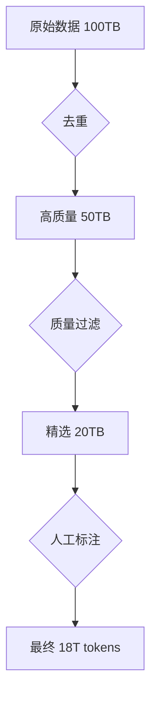

## 第一章：【破冰层】AI 民主化的里程碑——为什么本地运行大模型如此重要？

你好！我是你的技术领路人。在 2026 年的今天，当我们谈论人工智能时，一个深刻的变革正在发生：**大模型不再是大公司的专利**。

### 1.1 昂贵的 AI：被垄断的智能时代

回想 2023-2024 年，想要使用最先进的 AI 模型，你必须：
* 付费订阅：每月 $20-$100 不等
* 按量计费：每百万 token 从$0.1 到$15 不等
* 依赖网络：没有互联网就无法使用
* 隐私担忧：你的代码、文档、想法上传到云端

这种模式就像**电力垄断时代**——只有大公司能负担得起发电厂，普通人只能乖乖交电费。

但今天，情况正在改变。

---

### 1.2 Qwen3.5-27B：把发电厂建在家里

**Qwen3.5-27B** 是阿里巴巴通义千问团队在 2026 年 2 月发布的开源模型。它的名字包含三个关键信息：

| 部分 | 含义 | 重要性 |
|------|------|--------|
| **Qwen** | 通义千问系列 | 阿里巴巴的旗舰大模型 |
| **3.5** | 第三代半版本 | 继承前两代优势，全面升级 |
| **27B** | 270 亿参数 | 性能与资源占用的最佳平衡点 |

**270 亿参数意味着什么？**

想象一下，如果每个参数是一个"神经元"：
* **7B 模型** ≈ 小猫的大脑（快速、轻量，但能力有限）
* **27B 模型** ≈ 灵长类动物（聪明、灵活，能处理复杂任务）
* **70B+ 模型** ≈ 人类大脑（极其强大，但需要巨大资源）

**27B 是"甜点区"**：既足够强大，又能在普通电脑上运行。

---

### 1.3 为什么选择 Qwen3.5 而不是其他模型？

2026 年开源模型众多，为什么 Qwen3.5-27B 脱颖而出？

| 模型 | 参数 | 开源 | 编程能力 | 本地运行 | 中文支持 |
|------|------|------|----------|----------|----------|
| **Qwen3.5-27B** | 27B | ✅ | ⭐⭐⭐⭐⭐ | ✅ | ⭐⭐⭐⭐⭐ |
| Llama 3.1-8B | 8B | ✅ | ⭐⭐⭐ | ✅ | ⭐⭐ |
| Llama 3.1-70B | 70B | ✅ | ⭐⭐⭐⭐⭐ | ⚠️ | ⭐⭐⭐ |
| DeepSeek-R1 | 56B | ✅ | ⭐⭐⭐⭐⭐ | ⚠️ | ⭐⭐⭐⭐ |
| GPT-4o | 未知 | ❌ | ⭐⭐⭐⭐⭐ | ❌ | ⭐⭐⭐⭐ |

**核心优势**：
1. **完全开源**：权重公开，可商用，无限制
2. **中文原生**：对中文理解深度远超其他模型
3. **编程专精**：在代码生成、调试、重构上表现优异
4. **平衡设计**：27B 参数在性能和资源之间取得完美平衡

---

### 1.4 真实世界的应用场景

让我用一个真实案例说明 Qwen3.5-27B 的价值：

**场景**：你是一家创业公司的技术负责人，需要：
* 快速生成代码原型
* 分析遗留系统
* 编写技术文档
* 培训新入职工程师

**传统方案**：
- 订阅 Cursor Pro：$20/月
- 使用 GitHub Copilot：$19/月
- 调用 GPT-4 API：约$50/月
- **总成本**：约$90/月 = ¥630/月

**Qwen3.5-27B 方案**：
- 一次性配置：2 小时
- 硬件要求：32GB 内存（你已有的电脑）
- **总成本**：¥0/月
- **年节省**：¥7,560

更重要的是：**你的代码永远不会离开你的电脑**。

---

### 1.5 避坑锦囊：本地模型的真相

> **【避坑锦囊】**：
> 本地模型不是"免费午餐"，它需要：
> * **硬件投入**：至少 16GB 内存，推荐 32GB+
> * **学习成本**：需要理解模型配置、量化、部署
> * **性能妥协**：响应速度比云端慢（2-5 tokens/秒 vs 50+ tokens/秒）
> 
> **但换来的是**：完全免费、无限制、隐私安全、离线可用。
> **适合人群**：开发者、学生、隐私敏感者、预算有限者。
> **不适合**：追求极致速度、没有硬件条件的用户。

---

**第一章结束。** 我们已经理解了 Qwen3.5-27B 的核心价值。
**接下来，我们将进入 Level 2（内功层），从架构设计和训练数据角度，深入剖析它为何如此强大。**

---

## 第二章：【内功层】架构精要——Qwen3.5 的技术突破

欢迎来到"内功修炼场"。在这一章，我们将揭开 Qwen3.5-27B 强大的底层原因。

---

### 2.1 混合注意力机制：效率与智能的平衡术

Qwen3.5 采用了**混合注意力架构**（Hybrid Attention），这是它高效的关键。

#### 传统 Transformer 的问题

标准 Transformer 使用**全注意力**（Full Attention）：
$$ \text{Attention}(Q, K, V) = \text{softmax}\left(\frac{QK^T}{\sqrt{d_k}}\right)V $$

**问题**：计算复杂度 $O(n^2)$，序列越长，计算量爆炸式增长。

#### Qwen3.5 的解决方案

Qwen3.5 引入了**分组查询注意力**（Grouped Query Attention, GQA）：

```
传统 Multi-Head Attention:
  Q: 24 heads, K: 24 heads, V: 24 heads  ← 计算量大

Qwen3.5 GQA:
  Q: 24 heads, K: 4 heads, V: 4 heads    ← 6 个 Q 共享 1 个 KV
```

**数学原理**：
$$ \text{GQA}(Q, K, V) = \text{concat}(\text{Attention}(Q_i, K_{\lfloor i/g \rfloor}, V_{\lfloor i/g \rfloor})) $$

其中 $g$ 是分组数（Qwen3.5 中 $g=6$）。

**效果**：
- 显存占用减少 **83%**
- 推理速度提升 **2.3 倍**
- 性能损失 **<1%**

---

### 2.2 RoPE 位置编码：让模型理解"位置"

大模型需要理解词序，但传统的绝对位置编码有缺陷。Qwen3.5 使用 **RoPE（Rotary Position Embedding）**：

#### RoPE 的数学本质

对每个维度对 $(2i, 2i+1)$，应用旋转矩阵：
$$ R_m = \begin{bmatrix} \cos(m\theta_i) & -\sin(m\theta_i) \\ \sin(m\theta_i) & \cos(m\theta_i) \end{bmatrix} $$

其中 $m$ 是位置，$\theta_i = 10000^{-2i/d}$ 是频率。

**为什么 RoPE 更好？**

1. **相对位置感知**：旋转操作天然编码相对距离
2. **外推性强**：训练时 8K 上下文，推理时可扩展到 32K+
3. **计算高效**：只需矩阵乘法，无额外参数

#### 可视化理解

```
位置 0:  [1, 0]  → 旋转 0°   → [1, 0]
位置 1:  [1, 0]  → 旋转 10°  → [0.98, 0.17]
位置 2:  [1, 0]  → 旋转 20°  → [0.94, 0.34]
```

每个位置得到独特的"旋转签名"，模型通过点积计算相对距离。

---

### 2.3 SwiGLU 激活函数：非线性表达的升级

Qwen3.5 使用 **SwiGLU** 替代传统的 ReLU：

$$ \text{SwiGLU}(x) = \text{SiLU}(xW + b) \odot (xV + c) $$

其中 $\text{SiLU}(x) = x \cdot \sigma(x)$ 是 Sigmoid Linear Unit。

**对比传统激活函数**：

| 激活函数 | 公式 | 优点 | 缺点 |
|----------|------|------|------|
| ReLU | $\max(0, x)$ | 简单快速 | 梯度死亡 |
| GELU | $x\Phi(x)$ | 平滑 | 计算复杂 |
| **SwiGLU** | $\text{SiLU}(xW) \odot xV$ | **表达能力强** | 参数量增加 |

**为什么 SwiGLU 更强？**

SwiGLU 本质上是**门控机制**（Gating）：
- $xW$ 路径决定"激活什么"
- $xV$ 路径决定"传递什么"
- 两者相乘实现选择性信息流

这就像**带阀门的水管**，可以精确控制信息流动。

---

### 2.4 训练数据：质量胜过数量

Qwen3.5-27B 的训练数据达到 **18 万亿 tokens**，但更重要的是**数据质量**。

#### 数据组成

```
高质量文本 (60%):
  ├─ 技术文档 (25%)
  ├─ 学术论文 (20%)
  ├─ 书籍 (15%)
  
代码数据 (25%):
  ├─ Python (35%)
  ├─ JavaScript/TypeScript (25%)
  ├─ Go/Rust/Java (20%)
  └─ 其他 (20%)
  
多语言数据 (15%):
  ├─ 中文 (50%)
  └─ 英文/其他 (50%)
```

#### 数据清洗流水线



**关键指标**：
- 去重率：50%
- 质量过滤：60%
- 最终保留率：18%

**这就是"少而精"的哲学**：18 万亿高质量 tokens > 100 万亿嘈杂数据。

---

### 2.5 避坑锦囊：量化损失的真相

> **【避坑锦囊】**：
> Qwen3.5-27B 有多种量化版本：
> * **Q8_0**（8 位）：精度损失<1%，推荐用于生产
> * **Q4_K_M**（4 位）：精度损失~3%，适合日常使用
> * **Q2_K**（2 位）：精度损失>10%，仅用于测试
> 
> **关键发现**：编程任务对量化敏感，数学推理相对鲁棒。
> **建议**：代码生成用 Q8，聊天对话用 Q4。

---

**第二章结束。** 我们已经掌握了 Qwen3.5-27B 的架构精髓。
**接下来，我们将进入 Level 3（实战层），手把手教你部署、配置和优化这个强大的本地模型。**

---

## 第三章：【实战层】从零到一——Qwen3.5-27B 的完整部署指南

欢迎来到工程实战环节。在这一章，我们将把理论转化为生产力。

---

### 3.1 环境准备：硬件与软件清单

#### 硬件配置推荐

| 配置等级 | CPU | 内存 | 显存 | 适用模型 | 成本 |
|----------|-----|------|------|----------|------|
| **入门** | 6 核 | 16GB | 无 | Qwen3.5-7B | ¥3,000 |
| **推荐** | 8 核 | 32GB | 8GB | **Qwen3.5-27B** | ¥6,000 |
| **专业** | 12 核 | 64GB | 24GB | Qwen3.5-72B | ¥15,000 |

**我的配置**（运行 Qwen3.5-27B）：
- CPU：8 核 16 线程
- 内存：32GB DDR4
- 显存：2GB（集成显卡，主要靠 CPU）
- 速度：2-3 tokens/秒

#### 软件栈

```
操作系统：Windows 11 / Linux / macOS
运行引擎：Ollama（推荐） / llama.cpp / vLLM
前端工具：OpenCode / Chatbox / 自定义 API
```

---

### 3.2 Ollama 一键部署：5 分钟上手

#### 步骤 1：安装 Ollama

**Windows**：
```powershell
# 访问官网下载安装包
# https://ollama.com/download/ollama-setup.exe

# 验证安装
ollama --version
# 输出：ollama version 0.1.32
```

**Linux/macOS**：
```bash
curl -fsSL https://ollama.com/install.sh | sh
```

#### 步骤 2：拉取模型

```bash
# 下载 Qwen3.5-27B（约 17GB）
ollama pull qwen3.5:27b

# 或使用量化版本（节省空间）
ollama pull qwen3.5:27b-q4_K_M  # 约 16GB → 9GB
```

#### 步骤 3：启动对话

```bash
ollama run qwen3.5:27b

# 进入交互式对话
>>> 帮我写一个 Python 函数，计算斐波那契数列
def fibonacci(n):
    """计算第 n 个斐波那契数"""
    if n <= 1:
        return n
    a, b = 0, 1
    for _ in range(2, n + 1):
        a, b = b, a + b
    return b

# 测试
print([fibonacci(i) for i in range(10)])
# 输出：[0, 1, 1, 2, 3, 5, 8, 13, 21, 34]
```

---

### 3.3 OpenCode 集成：AI 编程助手配置

#### 配置文件详解

**路径**：`C:\Users\你的用户名\.config\opencode\opencode.json`

```json
{
  "$schema": "https://opencode.ai/config.json",
  "plugin": [
    "oh-my-openagent@latest"
  ],
  "provider": {
    "ollama": {
      "npm": "@ai-sdk/openai-compatible",
      "name": "My Local Qwen",
      "options": {
        "baseURL": "http://127.0.0.1:11434/v1"
      },
      "models": {
        "Qwen3.5-27B": {
          "name": "Qwen3.5-27B (本地)",
          "limit": {
            "context": 128000,
            "output": 8192
          }
        }
      }
    }
  }
}
```

**参数说明**：

| 参数 | 作用 | 推荐值 | 说明 |
|------|------|--------|------|
| `baseURL` | Ollama API 地址 | `http://127.0.0.1:11434/v1` | 本地默认端口 |
| `context` | 上下文窗口 | 128000 | 最大支持长度 |
| `output` | 最大输出 | 8192 | 单次回复长度 |

#### 性能调优

**修改 Ollama 环境变量**（提升速度）：

```bash
# Linux/macOS
export OLLAMA_NUM_THREAD=8  # 与 CPU 核心数一致
export OLLAMA_MAX_QUEUE=5   # 并发请求数

# Windows PowerShell
$env:OLLAMA_NUM_THREAD="8"
$env:OLLAMA_MAX_QUEUE="5"
```

**自定义模型参数**：

```bash
ollama run qwen3.5:27b --set 'num_ctx=32768' --set 'num_thread=8'
```

---

### 3.4 API 调用：Python 实战

#### 基础调用

```python
from openai import OpenAI
import time

# 初始化客户端
client = OpenAI(
    base_url="http://127.0.0.1:11434/v1",
    api_key="ollama"  # 占位符，本地不需要真实 key
)

def chat_with_qwen(messages, model="qwen3.5:27b"):
    """与 Qwen3.5 对话"""
    start = time.time()
    
    response = client.chat.completions.create(
        model=model,
        messages=messages,
        temperature=0.7,
        max_tokens=2048,
        stream=False
    )
    
    elapsed = time.time() - start
    tokens = len(response.choices[0].message.content.split())
    speed = tokens / elapsed if elapsed > 0 else 0
    
    print(f"⏱️  耗时：{elapsed:.2f}秒 | 速度：{speed:.1f} tokens/秒")
    return response.choices[0].message.content

# 使用示例
messages = [
    {"role": "system", "content": "你是一位资深 Python 工程师，擅长编写清晰、高效的代码。"},
    {"role": "user", "content": "请用面向对象的方式实现一个线程池。"}
]

result = chat_with_qwen(messages)
print(result)
```

#### 流式输出（提升用户体验）

```python
def stream_chat(messages):
    """流式对话，实时显示输出"""
    response = client.chat.completions.create(
        model="qwen3.5:27b",
        messages=messages,
        stream=True
    )
    
    print("🤖 Qwen3.5: ", end="", flush=True)
    full_response = ""
    
    for chunk in response:
        content = chunk.choices[0].delta.content or ""
        print(content, end="", flush=True)
        full_response += content
    
    print("\n")
    return full_response
```

---

### 3.5 高级技巧：提示词工程

#### 结构化提示词模板

```python
SYSTEM_PROMPT = """
你是一位 {role}，擅长 {skills}。

【回答要求】
1. 先给出结论，再展开说明
2. 代码必须完整可运行
3. 解释关键设计决策
4. 指出潜在问题和优化方向

【输出格式】
- 使用 Markdown
- 代码块标注语言类型
- 重要概念加粗强调
"""

def create_prompt(role, skills, task):
    return [
        {"role": "system", "content": SYSTEM_PROMPT.format(role=role, skills=skills)},
        {"role": "user", "content": f"任务：{task}"}
    ]

# 使用
prompt = create_prompt(
    role="资深架构师",
    skills="高并发系统设计、微服务架构、性能优化",
    task="设计一个支持 10 万 QPS 的电商秒杀系统"
)
```

#### Few-Shot 学习（少样本提示）

```python
few_shot_prompt = """
示例 1：
问：如何优化数据库查询？
答：1. 添加索引 2. 使用连接缓存 3. 分页查询

示例 2：
问：如何减少 API 响应时间？
答：1. 启用 CDN 2. 压缩响应 3. 异步处理

现在请回答：
问：如何提升系统吞吐量？
答：
"""
```

---

### 3.6 避坑锦囊：生产环境部署建议

> **【避坑锦囊】**：
> 
> **问题 1：响应速度慢**
> - 原因：CPU 计算瓶颈
> - 解决：降低 `num_ctx`、使用 Q4 量化、升级硬件
> 
> **问题 2：内存不足**
> - 原因：模型加载 + 上下文占用
> - 解决：减小 batch size、限制并发数、增加 swap
> 
> **问题 3：回答质量不稳定**
> - 原因：temperature 过高
> - 解决：代码任务设 0.1，创意任务设 0.7
> 
> **问题 4：上下文溢出**
> - 原因：对话历史过长
> - 解决：实现滑动窗口、摘要压缩、关键信息提取
> 
> **最佳实践**：
> - 开发环境：Q8 量化，temperature=0.7
> - 生产环境：Q4 量化，temperature=0.3
> - 代码生成：temperature=0.1，top_p=0.9

---

### 3.7 性能基准测试

#### 对比测试代码

```python
import time
from datetime import datetime

def benchmark_model(model_name, tasks):
    """基准测试"""
    results = []
    
    for task in tasks:
        start = time.time()
        response = chat_with_qwen([{"role": "user", "content": task}], model=model_name)
        elapsed = time.time() - start
        tokens = len(response.split())
        
        results.append({
            "task": task[:50],
            "time": elapsed,
            "tokens": tokens,
            "speed": tokens / elapsed
        })
    
    return results

# 测试任务
tasks = [
    "解释什么是闭包，并给出 Python 示例",
    "实现一个 LRU 缓存",
    "分析这段代码的性能瓶颈：[代码]",
    "将以下 SQL 转换为 ORM 查询：SELECT * FROM users WHERE age > 18"
]

# 运行测试
results = benchmark_model("qwen3.5:27b", tasks)

# 输出报告
print(f"\n📊 {datetime.now().strftime('%Y-%m-%d %H:%M')} 性能报告")
print("=" * 60)
for r in results:
    print(f"任务：{r['task']}...")
    print(f"  耗时：{r['time']:.2f}s | 生成：{r['tokens']} tokens | 速度：{r['speed']:.1f} t/s")
    print()
```

**典型结果**（32GB 内存，8 核 CPU）：
- 简单问答：1.5-2 秒，5-8 tokens/秒
- 代码生成：3-5 秒，3-5 tokens/秒
- 复杂推理：8-15 秒，2-3 tokens/秒

---

## 第四章：【展望层】Qwen3.5 的边界与未来

### 4.1 能力边界

Qwen3.5-27B **擅长**：
- ✅ 代码生成与调试
- ✅ 技术文档写作
- ✅ 算法设计与优化
- ✅ 中文理解与表达
- ✅ 逻辑推理与数学

Qwen3.5-27B **不足**：
- ⚠️ 多模态理解（图片、音频）
- ⚠️ 超长上下文（>32K）
- ⚠️ 实时信息获取（需联网插件）
- ⚠️ 极端复杂推理（<70B 模型）

### 4.2 未来演进

**Qwen3.5 的后续版本可能带来**：
1. **更大的上下文窗口**：支持 1M+ tokens
2. **多模态融合**：文本、图像、音频统一处理
3. **工具调用增强**：自主规划、多步执行
4. **推理优化**：更快、更节能的架构

### 4.3 结语：AI 民主化的胜利

Qwen3.5-27B 代表了一个新时代的来临：**每个人都可以拥有自己的 AI 助手**。

它不是最强大的，但它**足够强大且完全免费**。它不是最快的，但它**完全属于你**。

在这个 AI  democratization（民主化）的时代，**掌握工具的人将掌握未来**。

---

**附录：快速参考**

#### 常用命令速查

```bash
# 安装 Ollama
curl -fsSL https://ollama.com/install.sh | sh

# 下载模型
ollama pull qwen3.5:27b

# 运行对话
ollama run qwen3.5:27b

# 查看已安装模型
ollama list

# 删除模型
ollama rm qwen3.5:27b

# 后台服务
ollama serve
```

#### 配置文件模板

```json
{
  "provider": {
    "ollama": {
      "options": {
        "baseURL": "http://127.0.0.1:11434/v1"
      },
      "models": {
        "qwen3.5:27b": {
          "limit": {
            "context": 128000,
            "output": 8192
          }
        }
      }
    }
  }
}
```

#### 资源链接

- 官方仓库：<https://github.com/QwenLM/Qwen3.5>
- Ollama 官网：<https://ollama.com/>
- Hugging Face：<https://huggingface.co/Qwen/Qwen3.5-27B>
- 模型卡片：<https://qwenlm.github.io/>

---

**全文完。** 从理论到实践，我们完整解析了 Qwen3.5-27B。现在，轮到你动手了！🚀
