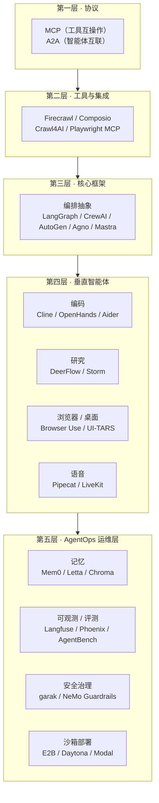

# 拆解 awesome-ai-agents：122 个 AI Agent 开源项目全景深度解析

> 数据说明：文中所有 star 数、归档状态、最近推送时间，都是我在 2026-08-31 用 GitHub API 逐个实测拉取的，不是抄的截图，也不是拍脑袋。清单本身会持续更新，具体数字请以仓库实时页面为准。分析对象是 [NipunaRanasinghe/awesome-ai-agents](https://github.com/NipunaRanasinghe/awesome-ai-agents) 这份清单，它收录了 122 个仓库链接，外加 7 篇论文、若干社区和 Newsletter 资源。

之前写过一篇[《2026 年 AI Agent 框架选型指南》](./2026年AI-Agent框架选型指南：从“大爆发”到“大灭绝”后的生存法则.md)，讲的是"大灭绝"之后主流框架的生存法则。这次换个角度：把 awesome-ai-agents 这张地图完整走一遍，122 个仓库逐个回答三个问题——**它能做什么？什么场景下用？和同类比处在什么位置？**

先说结论：这张清单最大的价值不是"收藏"，而是它无意中画出了一张 AI Agent 生态的分层地图。往下看你就明白为什么。

## 一、先看全景：生态其实是五层楼

清单把它收录的项目按用途分了十几个类目，但按"在整个技术栈里扮演什么角色"重新归位，会发现结构非常清晰：

协议在最底层做标准化，工具层负责让 agent 摸到真实世界，框架层提供编排抽象，垂直智能体解决具体行业问题，运维层负责让它活在生产环境里。清单里 122 个项目，每个都能在这五层里找到自己的位置。

先感受一下头部数据（Top 15，实测 star）：

| 排名 | 项目 | Stars | 一句话定位 |
| --- | --- | --- | --- |
| 1 | AutoGPT | 187k | 自主 agent 元年的开创者，现在转型低代码平台 |
| 2 | Firecrawl | 174k | 网页 → LLM 可用数据的抓取 API |
| 3 | LangChain | 145k | 从组件库进化成的"Agent 工程平台" |
| 4 | Browser Use | 112k | 让 LLM 直接操控浏览器的 Python 库 |
| 5 | Gemini CLI | 107k | Google 开源终端编码 agent |
| 6 | MCP Servers（官方） | 90k | MCP 参考服务器合集 |
| 7 | OpenHands | 86k | 全自主 AI 软件开发平台（前 OpenDevin） |
| 8 | DeerFlow | 81k | 字节开源的深度研究/长程任务 SuperAgent |
| 9 | Crawl4AI | 80k | 为 LLM 设计的开源爬虫 |
| 10 | Daytona | 72k | 跑 AI 生成代码的弹性沙箱基础设施 |
| 11 | MetaGPT | 70k | "AI 软件公司"多角色协作框架 |
| 12 | Cline | 67k | VS Code 里的自主编码 agent（现含 SDK/CLI） |
| 13 | AnythingLLM | 65k | 一体化本地 AI 应用（RAG + Agent + UI） |
| 14 | Mem0 | 64k | Agent 通用记忆层 |
| 15 | AutoGen | 61k | 微软多 agent 对话框架 |

注意一个反直觉的现象：star 最高的几个项目里，纯"框架"很少，大头是工具（Firecrawl、Crawl4AI）和编码 agent（Gemini CLI、OpenHands、Cline）。这个现象后面第七节展开。

## 二、核心框架层（40 个）：地基怎么选

清单"Core Frameworks"分类收了 40 个项目，从 18.7 万星的 AutoGPT 到个位数 star 的链上协议实验都有。我按梯队拆开讲。

### 2.1 第一梯队：11 个值得认真对待的框架

**LangChain + LangGraph（145k / 41k，Python + TS 双语言）**

LangChain 最早的标签是"LLM 应用组件库"，这两年定位明显变了——官方描述现在写的是"the agent engineering platform"。它现在的体系是三层：LangChain 负责高层抽象（agent、middleware），LangGraph 负底层的状态机编排，LangSmith/平台侧负责观测。LangGraph 是重点：把 agent 建模成带持久化的状态图，节点是函数，边是路由，原生支持 checkpoint、断点恢复、human-in-the-loop 和时间旅行调试。长流程、要容错、要审计的生产级 agent，它目前是 Python 生态里最稳的选择之一。代价是概念多、样板代码多，写个 hello world 也要理解 State、Node、Edge、Checkpointer 四件套。

**CrewAI（58k）**

角色扮演式多 agent 编排：定义有角色、目标、背景故事的 Agent，组成 Crew 分工协作，加上事件驱动的 Flows 做精确流程控制。上手极快，几十行代码就能跑一个"研究员+写手+审核员"的小团队，是给业务方演示多 agent 概念的最短路径。生产上要注意它的角色叙事是给人看的糖衣，执行层还是 LLM 调用编排，复杂协作场景的确定性要自己兜底。商业版走企业路线，全家桶含控制面板。

**AutoGen（61k，微软）**

学术界出身的多 agent 对话框架，核心抽象是"agent 之间互发消息直到任务完成"，GroupChat、代码执行、human proxy 这些设计影响了后来几乎所有框架。注意一个动向：微软已经宣布把 AutoGen 和 Semantic Kernel 的能力合流到新的 Microsoft Agent Framework，原仓库最近一次推送停在 2026 年 4 月——现在新项目直接上 AutoGen 需要想清楚迁移路径。它作为研究范式的地位毋庸置疑，作为新项目地基的时代可能正在翻篇。

**Agno（42k，前 Phidata）**

主打"快"和全栈：agent 运行时 + AgentOS 控制平面，内置记忆、知识库、工具、工作流，支持把 agent 部署成带 REST 接口的服务。适合想"一个框架解决从 demo 到部署"的团队。它的 AgentOS 概念（agent 的控制平面，管监控、配置、评估）代表了 2026 年框架层的一个明显趋势：框架不再只是个库，而是往运行时和平台长。

**smolagents（29k，Hugging Face）**

HF 出品的极简 agent 库，招牌是 CodeAgent：让 LLM 直接写 Python 代码作为行动（而不是 JSON 工具调用），官方 benchmarks 上代码行动比传统工具调用在推理效率上有明显优势。一千行左右的核心代码，五分钟读完抽象，天然兼容任意 HF 上的模型，也支持 MCP 和 E2B 沙箱。学习 agent 原理、做轻量原型的首选。要生产级的状态管理就得自己补。

**OpenAI Agents SDK（29k）**

OpenAI 官方轻量框架，四大原语：Agents（带指令的 LLM）、Handoffs（agent 间任务移交）、Guardrails（输入校验）、Sessions（会话管理），加上原生 tracing。虽然叫 OpenAI，实际通过 LiteLLM 支持 100 多家模型。它取代了早期的 Swarm 实验项目，也代表着 OpenAI 官方的 agent 形态主张——注意清单里另一个条目"OpenAI Assistants API"指向的 openai-python 仓库，Assistants API 本身已被官方宣布走向淘汰、被 Responses API 系列取代，选型时别把宝押在旧 API 上。

**Google ADK（21k）**

Google 的 Agent Development Kit，code-first 的 Python 工具包，强项是和 Google 云生态（Vertex AI、Gemini）的无缝集成、原生 A2A 协议支持、内置评估工具和多 agent 层级。如果你全家桶在 GCP 上，ADK 的顺滑度是外来的 LangChain 比不了的。

**Mastra（28k，TypeScript）**

TS 生态目前最完整的 agent 框架（Gatsby 创始团队出品）：工作流引擎（持久化、挂起恢复）、RAG、记忆、evals、MCP 支持，还自带本地 Playground。如果团队是 Node 栈、想避免 Python 跨语言调用，Mastra 基本是默认答案。

**MetaGPT（70k）**

"给 LLM 分配一家软件公司的岗位"：产品经理、架构师、工程师、QA 各司其职，按 SOP 流水线产出。研究范式的贡献巨大（"SOP 编码进 prompt"的思路影响了整个多 agent 领域），但作为生产工具偏重"一次性生成完整项目"的演示场景，仓库最近一次推送停在 2026 年 1 月，热度明显让位给了更工程化的方案。

**AutoGPT（187k）**

清单里 star 之王。2023 年它定义了"自主 agent"这个品类：给目标，自己拆任务、上网、写代码。三年过去，它自己也完成了转型——现在是低代码的 agent 平台（可视化搭建工作流的 AutoGPT Platform），早期"放出去自己跑"的纯自主形态反而成了历史。它的星数记录的是整个行业的注意力史。

**Strands Agents SDK（7k，AWS）**

亚马逊开源的"model-driven"agent SDK，理念是让模型自己驱动循环（prompt 里教它怎么调用工具即可），官方产品（如 Amazon Q）内部在用。背靠 AWS，主打生产可用性和可观测性集成，是这个梯队里上升势头最明显的新玩家。

### 2.2 九个框架横评：一张表看懂选型

| 框架 | 核心抽象 | 上手难度 | 多 agent | 状态/持久化 | 适合谁 |
| --- | --- | --- | --- | --- | --- |
| LangGraph | 状态图 + 检查点 | 较高 | 强（超图） | 原生最强 | 生产级长流程、强审计需求 |
| CrewAI | 角色 + 任务 + Flow | 低 | 强（叙事化） | 中 | 快速原型、业务演示 |
| AutoGen | 消息对话 | 中 | 强（群聊式） | 中 | 已有存量、研究验证 |
| Agno | Agent + 运行时 | 中 | 中 | 中强 | 全栈一体化倾向的团队 |
| smolagents | 代码即行动 | 低 | 弱 | 弱 | 学习、轻量原型、HF 生态 |
| OpenAI Agents SDK | 移交 + 护栏 | 低 | 中（handoff） | 中 | OpenAI 生态、中小规模 |
| Google ADK | 分层 agent 树 | 中 | 强 | 中强 | GCP 用户 |
| Mastra | 工作流 + 资源 | 中 | 中 | 强（TS） | Node/TS 团队 |
| Strands | 模型驱动循环 | 低 | 中 | 中 | AWS 用户 |

怎么读这张表：如果你的 agent 是"一次调用 3~5 个工具就完事"的短任务，选什么框架都行，挑顺眼的；如果任务链路长、中途会挂、需要人审和回放，LangGraph 这类带检查点的状态机抽象优势就出来了；如果核心诉求是"让不懂代码的业务同事搭工作流"，那 CrewAI 这类低门槛叙事化的更合适。

### 2.3 中腰部：各有绝活的一批

- **CAMEL（18k）**：角色扮演式多 agent 研究框架，学术贡献远大于工具属性，它是最早系统研究"两个 agent 互相配合完成任务"的项目，衍生出的 OWL 和大规模合成数据管线在研究圈很有名。做 agent 研究和合成数据生成值得看。
- **ChatDev（34k，OpenBMB）**：和 MetaGPT 同类的"虚拟软件公司"，2.0 版本强化了多 agent 协作流程。适合学术对比实验和教学演示。
- **AgentVerse（5k）**：多 agent 仿真环境，OpenBMB 系的研究配套，做群体行为模拟实验用。
- **SuperAGI（18k）**：2023 年明星项目，自带 GUI、工具市场、遥测的基础设施级 agent 平台。现在已经基本停更，是"自主 agent 平台"这一波退潮的标志性样本——它的架构文档今天仍值得读，代码别再当地基了。
- **Agency Swarm（5k）**：VRSEN（油管多 agent 教程主）出品，基于 OpenAI Assistants API 的角色编排，代码即文档的风格。教程生态是它的独特价值。
- **AGiXT（3k）**：老牌自适应自动化平台，链式指令、多 provider、持久记忆，社区驱动，功能全但复杂度也高。
- **Upsonic（8k）**：主打"可靠性层"：任务对象化、验证器/批评者角色、模型上下文协议支持。它对"agent 输出可信度"的工程化关注是差异点。
- **PraisonAI（9k）**：低代码多 agent + MCP + 工作流，Python/JS 双 SDK，宣传"微秒级启动"。本质是 LangGraph 式流程的一层易用封装，适合快速搭内部工具。
- **LightAgent（1.2k）**：轻量 Python 框架，记忆 + MCP/SSE + 流式 + LightSwarm 协作，中文文档友好，国内团队可以关注。
- **PocketFlow（11k）**：只有 100 行的极简框架，DAG 抽象，教学价值拉满——想真正理解"框架到底帮你做了什么"，读一遍 PocketFlow 源码比读十篇教程有用。
- **KodeAgent（40 星）**：极简 ReAct/CodeAct 引擎，带代码沙箱和可观测，star 很少但思路干净，适合当参考实现读。
- **Neurolink（juspay，128 星）**：多 provider 统一层，12+ LLM 接入，生产公司（juspay）背书的早期项目。
- **LLMStack（2.3k）**：无代码多 agent + 数据管道，拖拽式搭建，适合非程序员的内部工具场景。
- **Composio（30k）**：严格说不是框架，是"agent 的手和脚"——1000+ 预置工具集成（GitHub、Slack、Notion、Jira……），统一管认证和工具搜索，MCP 兼容。任何框架的 agent 要接 SaaS 工具，先用 Composio 可以省掉大量胶水代码。这一层正被 MCP 快速吃掉，但它的托管认证和工具搜索仍有独特价值。
- **AgentField（2.5k）**：把 agent 当微服务管的开源控制平面：路由、身份、内存、可观测。方向和 Agno AgentOS 类似，更偏基础设施。
- **Agentset（2.1k）**：生产级 agentic RAG 平台，混合检索 + 多模态，RAG 需求外包给它的话可以少写很多检索代码。
- **Taskade（62 星 repo，SaaS）**：AI 原生协作工作区 + agent 工作流，配套 Taskade MCP（163 星）把任务管理暴露给任意 agent。它代表"SaaS 产品化 agent"路线，和开源自建是两个世界。

### 2.4 早期实验田：star 不多，方向有意思

清单里混着一批 star 两位数甚至个位数的项目，按传统"awesome 清单"标准它们不够格，但方向值得记录：

- **fractal（704 星）**：层级化编码 agent 运行时——有界自主循环、递归委派、隔离的 Git worktree、SQLite 持久状态、运维者实时控制。它把"编码 agent 怎么安全地自主干活"工程化得相当细，git worktree 隔离这个设计尤其值得借鉴。
- **Summoner（24 星）**：agent 间通过长连 TCP 会话组网（Python/Rust），50+ 可运行模板，探索的是"去中心化 agent 网络"。
- **Hivekeep（51 星）**：单容器自托管"agent 团队"平台（Bun + SQLite），带 Web UI 和 TG/Slack/Discord 接入。
- **Orkas（1.6k）**：本地优先的多专家 agent 协作工作区。
- **Agentlas OS（1.1k）**：本地优先的"agent 操作系统"，主打可移植的 agent/团队打包、跨主机编排和验证门禁。
- **Hivemoot Colony（4 星）**：agent 民主自治实验——提案、投票、互审、合并全靠共识机制。
- **OIXA（1 星）**：跑在 Base 链上的 agent 经济市场协议，链上托管 + A2A 集成。

这批项目的共同点：都在回答"agent 有了之后，组织和治理怎么办"。现在下结论太早，但下一波叙事大概率从这里面长出来。

## 三、垂直智能体层：解决具体问题的选手

### 3.1 编码智能体（12 个）：最卷的赛道

按形态分四类看：

**IDE 内置型**

- **Cline（67k）**：VS Code 插件起家的自主编码 agent，现在有 SDK 和 CLI 三种形态。核心体验：计划/执行双模式、每一步人工审批、MCP 扩展、浏览器使用、检查点回滚。BYOK 模式自带 key 即可，是目前"插件型 agent"的事实标准之一。
- **Gemini CLI（107k）**：Google 开源的终端 agent，百万 token 上下文 + 免费额度给得非常大方，个人开发者几乎零成本上手。开源半年冲到十万星，靠的是"官方出品 + 免费够用"。
- **Goose（54k，Block）**：Block（Square 母公司）出品的可扩展 agent，MCP 优先设计，不只写代码，装依赖、跑测试、执行运维动作都行。企业内部大规模实践过的背景让它对"真实工作流"的理解比较深。

**终端结伴型**

- **Aider（49k）**：终端里的 AI 结对编程鼻祖级项目，git 深度集成（每个改动自动提交）、repo map 机制让它对大仓库的理解特别好，支持 100+ 模型。2026 年更新节奏明显放缓（最近推送 2026-05），社区有维护上的担忧，但存量用户和设计思想（尤其是 repo map 和 git 纪律）影响力仍在。

**全自主平台型**

- **OpenHands（86k，前 OpenDevin）**：开源自主开发 agent 平台，沙箱运行时 + 事件流架构，LLM 无关（LiteLLM），在 SWE-bench 类基准上长期处于开源第一梯队。给一个 issue 让它自己干到 PR，就是它的目标场景。有云版也有自托管。
- **SWE-agent（20k，普林斯顿）**：和 SWE-bench 基准同源的研究项目，贡献了"Agent-Computer Interface"这个重要概念——给 agent 设计一个顺手的命令行接口，比换更强的模型更能提升表现。学术价值标杆。
- **Plandex（16k）**：终端里的"大型任务"编码引擎，长任务先拆计划再逐块执行、沙箱分支、失败自动重试，对"改不动的大活"有独特设计。
- **AgenticSeek（27k）**：完全本地的自主 agent（浏览器 + 编码），卖点是"零 API 成本、数据不出本机"，是 Manus 的本地平替方向上最受关注的项目。本地小模型的能力上限决定了它的实际效果，但隐私场景刚需。

**应用生成器型**

- **GPT Pilot（34k，Pythagora）**：从零生成完整应用的"AI 开发者"，强调分步生成 + 人审。项目已商业化为 Pythagora 产品线，开源版更新放缓。
- **bolt.diy（20k）**：bolt.new 的开源社区分支，浏览器里跑 WebContainer 直接生成并运行全栈 Web 应用，支持 19+ 模型商。教学、原型、demo 场景体验极佳。
- **Devika（20k）**：早期的开源"Devin 平替"，设计文档一度很火，实际完成度有限，现在基本停更——又一个"2023 愿景、2026 现实"的样本。

**已归档**：microsoft/TaskWeaver（6k，代码优先的数据分析 agent，2026 年归档）。做数据分析 agent 的可以读它的设计，别再投入了。

编码 agent 怎么选？我的实际体感：日常写代码，IDE 型（Cline）和终端型（Gemini CLI/Aider）二选一，看你更依赖编辑器还是命令行；给整个 issue 自主交付，用 OpenHands 这类平台型，但要配好沙箱和 review 流程；内部工具做"自然语言生成应用"的演示，bolt.diy 出效果最快。

### 3.2 研究智能体（9 个）

**三大主力对比：**

| | GPT Researcher（29k） | Storm（31k，斯坦福） | DeerFlow（81k，字节） |
| --- | --- | --- | --- |
| 核心思路 | 规划 agent + 执行 agent 并行研究 | 多视角提问 + 知识策划 | 长程 SuperAgent 架构 |
| 产出 | 带引用的研究报告 | 维基百科式长文 | 报告/代码/多形态产出 |
| 风格 | 工程实用，开箱即用 | 学术严谨，引用质量高 | 平台化野心，human-in-the-loop |
| 现状 | Tavily 公司持续维护 | 更新放缓（最近推送 2025-09） | 高速进化，已超"研究"范畴 |

- **GPT Researcher**：最"拿来就用"的自动研究报告 agent，规划者拆子问题、执行者并行抓取、聚合出带引用的报告，背后是做 Tavily 搜索 API 的团队。要给产品加"自动研究报告"功能，从它开始改最省事。
- **Storm**：斯坦福的知识策划系统，核心创新是"多视角提问"——模拟不同背景的编者从多个角度向话题专家提问，再综合成文，引用密度是三个里最高的。Co-STORM 还扩展成了多人协作讨论模式。适合对内容质量和出处要求高的场景。学术项目节奏，工程化程度一般。
- **DeerFlow**：字节开源，从"深度研究框架"一路进化成现在描述的"长程 SuperAgent harness"——研究、编码、创作都能干，带沙箱、记忆、工具、子代理和消息网关。8 万星说明它踩中了开源社区的需求。如果你的需求是"一个能长时间干活的研究型助手"，它是目前开源里最完整的参考实现。

**学术向小项目**（都是早期作品，看方向）：Dr. Claw（1k，本地科研工作流：调研→选题→实验→发表→推广五阶段）、Caesar（7 星，边探索边建知识图谱 + 对抗式综合改稿）、Agon（44 星，"提示经济"角色复用编排：科学家/程序员/审计员循环）、P2PCLAW（44 星，去中心化 P2P 科研 agent 集群）、CAJAL（20 星，按 IMRaD 结构生成本地科学论文）、AutoNumerics（3 星，自然语言生成偏微分方程数值求解器并自动验证）。star 都不高，但"科研全流程自动化"这个方向上的多样性很能说明问题。

### 3.3 创意智能体（2 个）

- **ShortGPT（8k）**：短视频自动生成框架，脚本撰写、配音（TTS）、素材匹配、时间线剪辑全流程自动化。做批量内容矩阵的会感兴趣。
- **AI-town（10k，a16z）**：虚拟小镇，AI 角色带记忆和社交关系实时互动，基于 Convex + PixiJS。技术上是"生成式 agent 模拟"（斯坦福 generative agents 论文的工程化），可玩性高，也是游戏 NPC 和社交模拟的入门参考。

### 3.4 浏览器与桌面操作（10 个）：五条技术路线

这个类别是理解 2026 年 agent 落地的关键，因为"让 AI 操作电脑"是最直接的通用劳动力想象。五个流派：

**路线一：DOM 库（给 LLM 一双操作网页的手）**

- **Browser Use（112k）**：把网页转成 LLM 可读的结构 + Playwright 动作集，LLM 自己决定点哪、填什么。Python 几行代码起步，视觉 + DOM 混合定位，是目前这个领域引用量最高的开源库，无数 agent 框架把它当默认浏览器后端。

**路线二：确定性框架（代码为主，AI 兜底）**

- **Stagehand（24k，Browserbase）**：TS 框架，在 Playwright 之上加了 act/extract/observe 三个 AI 原语——常规步骤写死代码保证确定性，搞不定的步骤交给 AI，失败还能自愈。工程团队最爱这种"AI 是调味料不是主菜"的哲学。
- **Playwright MCP（37k，微软）**：把 Playwright 通过 MCP 协议暴露给任意 agent，亮点是基于无障碍树（accessibility tree）而非截图，速度快、token 省、可复现。Cline、Copilot 等大量工具的浏览器能力都接的它。如果只想给现有 agent 添浏览器技能，这是最轻的路。

**路线三：视觉工作流（不写代码，描述任务即可）**

- **Skyvern（23k）**：LLM + 计算机视觉直接操作浏览器完成工作流，不依赖站点特定的选择器，见过的没见过的网站都能试。适合批量表单、投标、政务流程这类"网站不归你控制"的自动化。

**路线四：原生 GUI（跳出浏览器，操作整个桌面）**

- **UI-TARS Desktop（39k，字节）**：基于字节自研 UI-TARS 视觉模型的原生应用 agent，自然语言指挥它操作桌面和浏览器。配套的 Agent TARS 框架把"GUI 理解"做成了完整技术栈。
- **Agent S（12k，Simular）**：桌面 GUI agent 开源框架，层级化规划和 Agent-Computer Interface 设计，在 OSWorld 等桌面操作基准上成绩领先。学术和工业两边都认。

**路线五：浏览器扩展（轻量、贴身）**

- **NanoBrowser（14k）**：Chrome 扩展形态的多 agent 浏览助手（规划器 + 导航器 + 验证器），自带 key 就能用，适合个人日常提效。
- **Xquik（191 星）**：X/Twitter 的数据与动作 API（REST/MCP/Webhook），给 agent 提供搜索、监控、发帖能力，垂直数据源方向的小而美。

**数据获取双雄**（严格说是"给 agent 供料"的基础设施）：

- **Firecrawl（174k）**：网页 → LLM 友好 markdown/结构化数据，现在定位是"context API"——搜索、抓取、交互一体。清单里 star 第二高，说明"给 LLM 供干净数据"是何等刚需。开源可自托管，云 API 免运维。
- **Crawl4AI（80k）**：开源 LLM 友好爬虫，异步、可定制、深度整合 RAG 场景。和 Firecrawl 的区别：Crawl4AI 是纯开源库、自己部署自己玩；Firecrawl 开源核 + 商业云，省心但要钱。自建数据管道选 Crawl4AI，快速集成选 Firecrawl。

### 3.5 语音智能体（3 个）

- **Pipecat（15k，Daily）**：实时语音/多模态对话 agent 的 Python 框架，管道式编排 STT→LLM→TTS，传输层无关（WebRTC/WebSocket/电话），服务随便换。做语音助手从它开始搭最快。
- **LiveKit Agents（14k）**：WebRTC 基础设施公司 LiveKit 出品，天然强在传输和会议/电话场景（SIP 接电话），job 派发模型适合大规模并发语音 agent。要打电话、开会的选它。
- **TEN Framework（11k，Agora）**：组件化（扩展机制）实时会话框架，多模态，和 Agora RTC 深度绑定。做嵌入式/会议硬件方向的可以看。

一句话选型：快速验证用 Pipecat，生产电话/会议级用 LiveKit，硬件集成看 TEN。

### 3.6 语言绑定生态（11 个）

框架层这场仗，本质是"哪个语言生态的工程能力"在打：

| 项目 | 语言 | Stars | 现状点评 |
| --- | --- | --- | --- |
| Semantic Kernel | C#/.NET | 29k | 微软企业系主力，正与 AutoGen 合流入 Agent Framework |
| Haystack | Python | 26k | deepset 出品，2.x 管道组件化，RAG 生产系统老牌劲旅 |
| LangChain.js | TS | 18k | JS 生态组件库，配 LangGraph.js 用 |
| LangChain4j | Java | 13k | Java 生态事实标准之一，Quarkus/Spring 集成好 |
| LlamaIndexTS | TS | 3k | 已归档，JS 用户转向 Mastra 或 LangChain.js |
| LangChainGo | Go | 10k | Go 生态的编排选择，功能子集 |
| LangChain.rb | Ruby | 2k | Ruby 生态补位 |
| TypeChat | TS | 9k | 微软"用 TS 类型约束 LLM 输出"的实验，思路已融进各框架的 structured output |
| Swarms-rs | Rust | 176 | Rust 集群编排，超早期 |
| AnythingLLM | JS | 65k | 严格说不是语言绑定，是一体化应用：桌面/Docker 一键起，RAG + Agent + 多用户，本地优先（Ollama 友好），是"不想写代码用上 agent"的首选 |

企业技术栈选型规律很直白：.NET 用 Semantic Kernel，Java 用 LangChain4j，Python 随便挑（生态最厚），TS 用 Mastra/LangChain.js。跨语言团队要特别小心"各语言各搞一套"导致的 agent 定义分裂——这也是为什么协议层（见 4.6）越来越重要。

## 四、AgentOps 运维层：从 demo 到生产之间隔着这 28 个项目

demo 和生产的区别是什么？demo 一次成功就是成功；生产要考虑 agent 记不住用户、跑了三小时花了几十刀、没人知道它哪步出的错、输出把用户隐私吐出去了。这一层的项目都在解决这些问题。

### 4.1 记忆（6 个）

- **Mem0（64k）**：通用记忆层。它的核心不是"存"而是"管"——从对话里抽取事实、与旧记忆冲突检测、合并更新、按需检索，还有图谱记忆（实体关系）。SDK 两行代码接入，云版全托管。目前"给现有 agent 加记忆"的最短路径。
- **Letta（24k，前 MemGPT）**：MemGPT 论文的工程化，操作系统式分页记忆（主上下文 + 外部存储自动换页），agent 能自己编辑自己的记忆，还有"睡眠时计算"（agent 闲时自我整理）。它做的是"有状态 agent 服务器"这个更完整的品类，不止是个库。
- **Chroma（29k）**：嵌入式友好的向量数据库，API 简单到离谱，现在是"AI 搜索基础设施"定位。原型和小中型 RAG 的默认起点。
- **Weaviate（17k）**：面向规模的向量数据库，混合检索（向量 + 关键词）、模块化量化器、多租户，生产级 RAG 老牌选手。
- **Tree-Ring Memory（15 星）**：本地优先的记忆 CLI/TUI，做召回、遗忘、审计、合并——"遗忘权"和记忆审计这个切入点很新。
- **Portable Handoff（21 星）**：在多个编码 agent 工具间交接会话上下文的本地 CLI，mini 但方向实用。

选型直觉：要"记用户聊过什么"用 Mem0；要做"越用越懂你的长命 agent"研究 Letta；底层向量检索 Chroma（轻）/ Weaviate（重）。别把 Mem0 和 Chroma 对立起来——一个管记忆的"语义与生命周期"，一个管向量的"存与查"，经常一起用。

### 4.2 评测（6 个）

- **AgentBench（4k，清华）**：多环境 agent 基准（操作系统、数据库、网页、游戏等 8 个环境），学术测评的标准引用物之一。
- **Agent Evaluation（371 星，AWS Labs）**：用"虚拟环境"概念测试 agent 的自然语言测试框架，把 pytest 思路带进 agent 评测。
- **Simple Evals（5k，OpenAI）**：OpenAI 官方轻量评测库，模型能力基准测试的参考实现。
- **LangTrace（1.2k）/ agenttrace（127 星）/ ax（104 星）**：三个小工具分别盯 LLM 追踪可视化、编码 agent 会话的成本/延迟/失败率、以及本地证据图谱。这一层的共同主题是"你的 agent 每天花了几块钱、死在哪一步"——量小但痛点真实。

### 4.3 可观测性（5 个）

| | Langfuse（34k） | Phoenix（11k，Arize） | Helicone（6k） | OpenLLMetry（7k，Traceloop） | Laminar（3k） |
| --- | --- | --- | --- | --- | --- |
| 接入方式 | SDK（框架级集成广） | OTel 原生 | 网关代理（一行代码） | OTel 仪表化库 | SDK + Rust 摄入 |
| 强项 | 全功能平台：追踪+评估+提示管理+数据集 | OTel 生态兼容、实验评估框架 | 成本/用量/缓存/限流 | 标准化 span 语义 | 轻快、trace + eval 一体 |
| 部署 | 自托管/云 | 自托管/云 | 自托管/云 | 接任意 OTel 后端 | 自托管/云 |

选型口诀：要"平台开箱即用"选 Langfuse（社区最活跃）；已是 OpenTelemetry 重度用户选 Phoenix 或 OpenLLMetry（观测规范统一进现有体系）；只想知道"花多少钱、谁花的"套个网关用 Helicone；追求轻量自托管看 Laminar。

### 4.4 部署与沙箱（4 个）

- **E2B（14k）**：Firecracker 微虚拟机沙箱，让 agent 生成的代码在隔离环境里安全执行，Python/JS SDK，百毫秒级启动。做代码解释器、数据分析 agent、coding agent 的标准底座。
- **Daytona（72k）**：定位"跑 AI 生成代码的弹性基础设施"，沙箱创建速度和规模弹性是卖点，SDK 干净。清单里 star 第六高的项目，说明"agent 需要安全执行环境"已经是共识级需求。
- **Modal（client 511 星，公司是大公司）**：通用 serverless GPU 平台，装饰器一把梭，训练推理批处理都行。agent 的重计算环节放 Modal 上弹性跑是常见架构。注意它开源的只是 client，平台本身是商业服务。
- **OctoAI（条目已失效）**：原推理基础设施公司 2024 年被 NVIDIA 收购，清单里的链接如今指向一个不相干的"分析操作系统"项目——这个条目已经死了，详见第七节"清单腐烂"。

### 4.5 安全与治理（7 个）：三层防线

**第一层：输入输出过滤（防御性编程）**

- **Presidio（11k，微软系）**：PII（个人身份信息）检测/脱敏/匿名化，文本图像结构化数据都行，NLP + 规则双引擎，企业数据合规的成熟件。
- **LLM Guard（3k）**：提示与输出的双向安检机（注入检测、敏感信息、毒性），2026 年归档了，思路被后续项目继承。
- **Polaxis（2 星）**：执行前防火墙，七层威胁检测 + 支出控制，超早期但"给 agent 的操作设预算上限"这个点切得准。

**第二层：行为护栏（运行时约束）**

- **NeMo Guardrails（7k，NVIDIA）**：Colang 语言编程对话轨：话题范围、安全边界、拒答策略，对话级控制最成熟。
- **Guardrails AI（7k）**：输出校验框架，结构/类型/内容不合规就自动纠正或重试，"rail"生态可插拔。
- **Agent Governance Toolkit（6k，微软）**：自主 agent 的治理套件——策略执行、零信任身份、执行沙箱，把"agent 作为数字员工的身份与权限管理"正式提上日程。

**第三层：主动攻击测试（红队思维）**

- **Garak（9k，NVIDIA）**：LLM 漏洞扫描器，probe 模式穷举提示注入、数据泄漏、幻觉、越狱，名字取自星际迷航里那个"什么都会解码"的 Garak。上线前先扫一遍，是 2026 年做 agent 的基本礼仪。

### 4.6 协议（4 个）：唯一确定性的主线

- **MCP（Model Context Protocol，9k 规范 + 90k 官方服务器合集）**：Anthropic 2024 年底开源的"agent 连接工具与数据"的标准协议，JSON-RPC 之上的工具/资源/提示三原语，加采样和根目录等能力。OpenAI、Google、主流 IDE 全部跟进，两年内成了事实标准。它解决的是 M×N 集成爆炸：M 个 agent 框架对接 N 个工具，从 M×N 变成 M+N。官方 servers 合集（Filesystem、Git、GitHub、Slack、Postgres……）是现成的轮子库。
- **A2A（Agent2Agent，26k）**：Google 发起、捐给 Linux 基金会的"agent 之间互联"协议，Agent Card 自我介绍、任务生命周期、不透明协作（各 agent 内部实现互不干涉）。和 MCP 是互补关系：MCP 管"agent ↔ 工具"，A2A 管"agent ↔ agent"。跨框架、跨厂商的 agent 协作（比如你的 LangGraph agent 调用别家的 Claude agent）就靠这类协议。
- **FastMCP（27k，PrefectHQ）**：Python 写 MCP 服务器的标准方式，装饰器一把梭，从"参考实现的简化版"长成了社区事实标准。写 MCP server，闭眼选它。

理解这一层的意义：框架会死，协议会长存。2023 年你押的框架可能已经停更（SuperAGI），2024 年押的协议（MCP）现在无处不在。把系统的可迁移性建立在协议上，把效率建立在当下最好的框架上。

## 五、研究资源、基准与社区

**7 篇论文速览**（清单收录，agent 研究的主干文献线）：

| 论文 | 主题 |
| --- | --- |
| The Rise of LLM-Based Agents | LLM agent 综述，入门第一篇 |
| Tool Learning with Foundation Models | 工具学习范式，工具调用的理论源头 |
| Multi-Agent Collaboration | 多 agent 协作的机制与挑战 |
| LLM based Multi-Agents | 多 agent 进展与挑战综述 |
| Agentic AI Systems | agentic AI 系统的组件与应用 |
| A Survey on LLM-based Autonomous Agents | 自主 agent 专题综述 |
| OptimAI | 四 agent 管线 + 赌臂调度，把优化问题翻译成求解器代码 |

**3 个基准**：ToolBench（6k，API 工具调用基准，ToolLLM 配套）、SOTOPIA-π（85 星，多 agent 社交智能基准，微调方向）、PerspectiveGap（3 星，多 agent 编排提示词基准，110 场景 × 10 拓扑——"编排提示词也有 benchmark"本身就是个信号）。

**社区与资讯**：LangChain Discord、AutoGen Discussions、AgentOps Discord、Letta Discord，加上 DeepLearning.AI 的 The Batch 周报。清单在这块比较薄，实际跟进生态建议再加 Twitter/X 的 agent 圈和各项目 changelog。

## 六、横向选型决策表：按场景直接查

最后把 122 个项目收拢成一张"场景 → 首选 → 备选"表：

| 你的场景 | 首选 | 备选 |
| --- | --- | --- |
| 给应用加个能用工具的 agent（Python，快） | OpenAI Agents SDK | smolagents / Agno |
| 生产级长流程、要检查点和人审 | LangGraph | Google ADK / Mastra(TS) |
| 业务同事要参与编排、快速演示 | CrewAI | LLMStack（无代码） |
| 企业 .NET / Java 技术栈 | Semantic Kernel / LangChain4j | — |
| 不写代码、本地跑一个全能 AI 工作台 | AnythingLLM | Hivekeep（自托管团队） |
| 日常编码助手 | Cline（IDE）/ Gemini CLI（终端，免费额度大） | Aider / Goose |
| 整个 issue 交给 agent 自主交付 | OpenHands | SWE-agent（研究向） |
| 完全本地、数据不出机器 | AgenticSeek | — |
| 自动生成研究报告 | GPT Researcher（工程）/ Storm（严谨） | DeerFlow（平台化） |
| 长程多技能 agent（研究+编码+创作） | DeerFlow | — |
| 给 agent 添加浏览器操作 | Browser Use（Python）/ Stagehand（TS） | Playwright MCP（最轻） |
| 无人值守批量网页工作流 | Skyvern | — |
| 桌面 GUI 自动化 | UI-TARS Desktop | Agent S |
| 网页转 LLM 数据 | Firecrawl（省心）/ Crawl4AI（自建） | — |
| 实时语音助手 | Pipecat | LiveKit Agents（电话/会议） |
| agent 记忆 | Mem0 | Letta（有状态服务器） |
| 向量检索底座 | Chroma（轻）/ Weaviate（重） | — |
| LLM 可观测平台 | Langfuse | Phoenix（OTel 系） |
| agent 代码安全执行 | E2B | Daytona / Modal（重计算） |
| 输出合规护栏 | NeMo Guardrails（对话）/ Guardrails AI（结构） | Presidio（PII）/ Garak（攻击测试） |
| 工具集成 | Composio | MCP + FastMCP（自建） |
| agent 互联 | A2A | Summoner（实验性组网） |

## 七、从 122 个数据点看生态：五个观察

**观察一：工具层比框架层更"值钱"。** star 前十名里工具和基础设施占了大半（Firecrawl 174k、Browser Use 112k、Crawl4AI 80k、Daytona 72k）。框架解决的是"怎么编排"，工具解决的是"能不能摸到真实世界"。模型越强，编排越不值钱，工具越值钱——因为强模型对编排抽象的需求在下降，对干净上下文的需求在上升。

**观察二：编码 agent 是卷王赛道，且已经分层完成。** IDE 插件（Cline）、终端（Gemini CLI/Aider）、自主平台（OpenHands）、应用生成（bolt.diy）四个生态位都有 2 万星以上的玩家，说明市场真实；但 2023 年那批"自主编码 agent"概念项目（Devika 停更、GPT Pilot 商业化、TaskWeaver 归档）基本都交出了自己的位置——活下来的是"人在环里"的工具，而不是"全自动替代程序员"。

**观察三：纯自主 agent 在退潮，"可控性"在回归。** AutoGPT 转型低代码平台，SuperAGI 停更，清单里 2026 年新增的项目（fractal 的"有界自主循环"、Agentlas 的"验证门禁"、Polaxis 的"执行前防火墙"、Governance Toolkit 的零信任）全都在给自主性加边界。行业用三年时间验证了一件事：无人监督的自主循环不可靠，可控的半自主才是生产力。

**观察四：清单也会腐烂，用 star 判断项目要小心。** 我实测发现 4 个问题条目：ofekron/better-agent 收录后已 404；octoai/octoAI 链接指向了被收购后变身的无关项目；TaskWeaver、LLM Guard、LlamaIndexTS 三个已归档；SuperAGI、Storm、MetaGPT、Aider 等更新明显放缓。教训很实在：看清单选型时，先看 Last commit 日期和 Archived 状态，star 是历史的快照，不是活的健康度。

**观察五：协议是唯一的确定性。** 122 个项目里，增长最确定的是 MCP（规范 9k + 服务器合集 90k + FastMCP 27k）和 A2A（26k）。框架的 API 三个月一变，协议的兼容性承诺以年计。如果你想在一个快速变化的生态里做"不会白干的投入"，写 MCP 服务器比押注任何一个框架都稳。

## 八、写在最后

122 个项目全拆完，给你三条可执行的建议：

第一，按"层"建认知，按"场景"做选型。别试图追平所有项目——那不可能，这个清单每个月都在变。记住五层结构（协议 → 工具 → 框架 → 垂直智能体 → 运维），遇到具体需求时查第六节的表就够了。

第二，用"会死的东西"换效率，用"不会死的东西"换寿命。框架、封装、平台选当下最顺手的，反正能换；把工具接口、数据资产、提示词资产沉淀在 MCP 这类协议和自有代码上，这些不会因为某个框架停更而作废。

第三，动手读几个小而美的源码。PocketFlow 的 100 行、smolagents 的 CodeAgent、SWE-agent 的 ACI 设计，这三个花不了一个周末，但能让你彻底看穿"框架到底帮你做了什么"——此后再看任何新框架，都是旧知识的排列组合。

本文的数据快照（122 个仓库的 star、语言、许可证、归档状态、最近推送）是我 2026-08-31 通过 GitHub API 实测采集的，分析中所有引用数字均来自该次采集，可复现。清单本身活跃维护，如果你在读到这篇文章时发现了新的宝藏项目，欢迎来[博客仓库](https://github.com/langkemaoxin/langkemaoxin.github.io)交流。

*相关阅读：[2026 年 AI Agent 框架选型指南](./2026年AI-Agent框架选型指南：从“大爆发”到“大灭绝”后的生存法则.md) · [MyPi：两个 Python 文件实现最简 Agent](./mypi-build-minimal-agent.md)*
