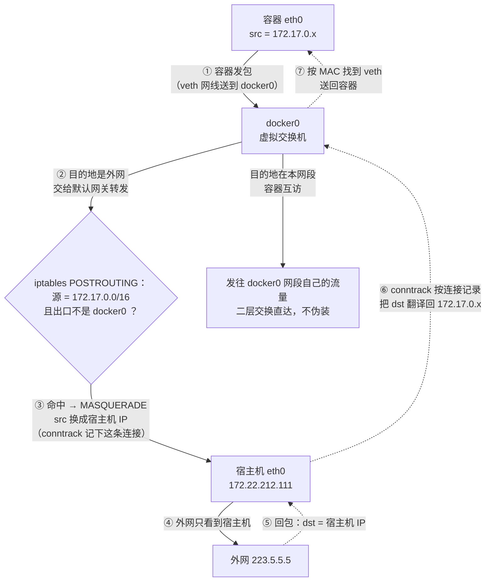
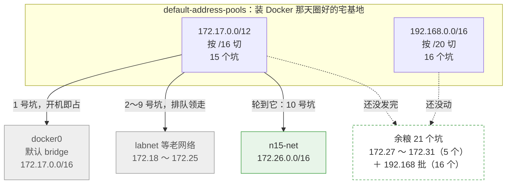
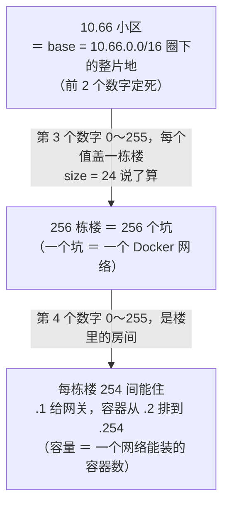
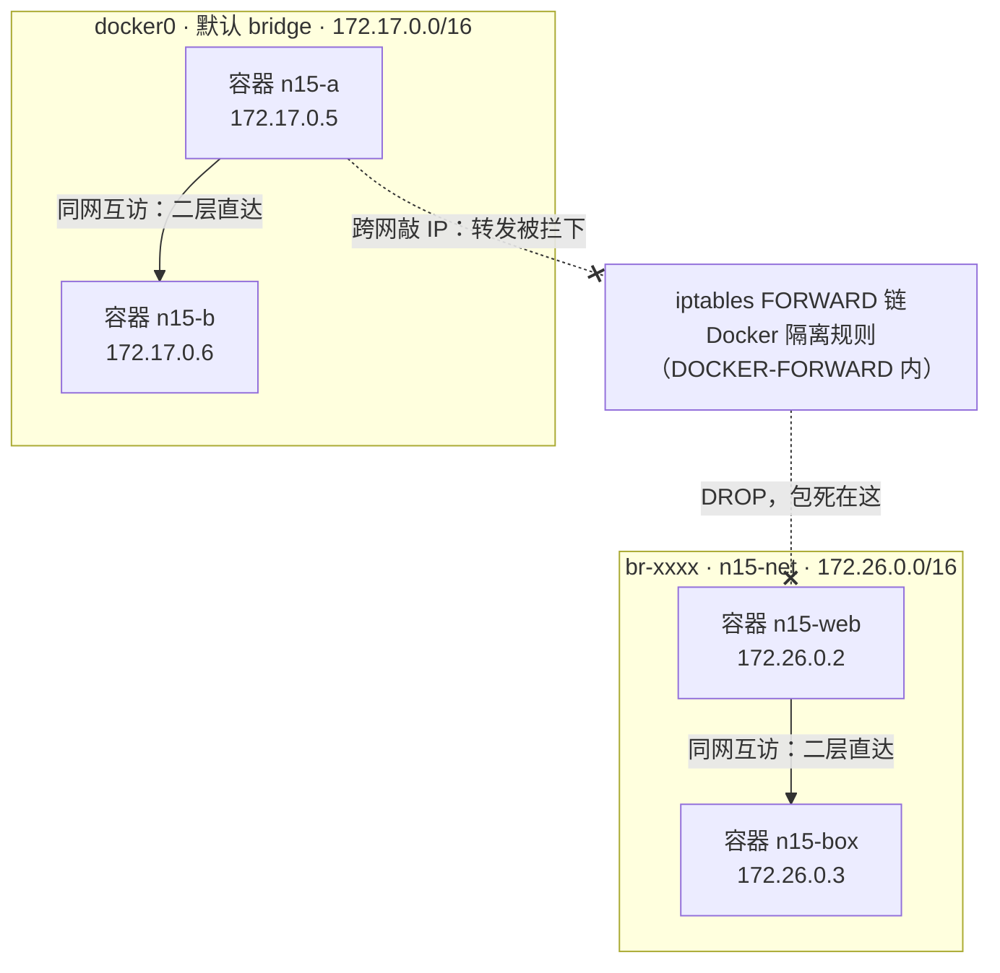
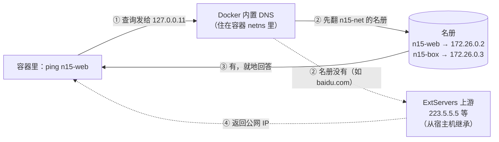
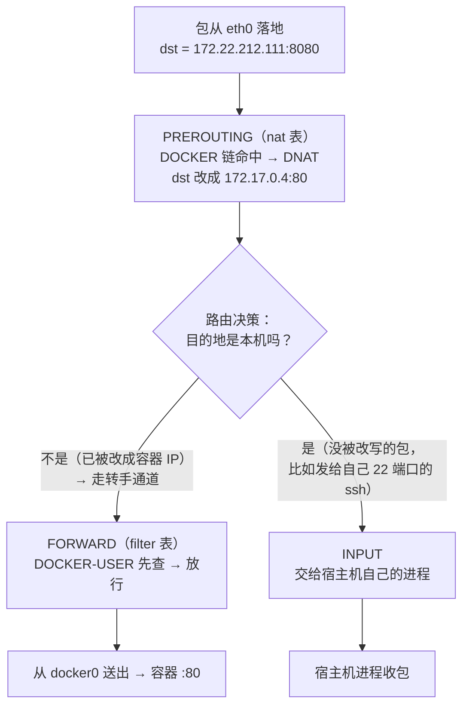

> **Docker 系列 · 第 15/33 篇**
> 上一篇：[《数据持久化——从容器一删数据就没，滚到三种挂载（师生对话实录）》](/云原生/docker/docker-14-data-persistence) · 下一篇：[《Docker Compose 编排——从一个 Nginx 滚成一整栈》](/云原生/docker/docker-16-compose)
> 
> 本篇是阶段 4「网络」的主课：容器不是孤岛，流量怎么进出、容器怎么互访，一条链路拆到底。下一篇 Compose 里服务名互访，用的就是这一篇的机制。

---

## 写在前面

前面几篇里，容器已经会跑、会存数据了。但真实应用从来不是单个容器：Web 要连数据库，数据库要连缓存——一对上「容器之间怎么通信」，我就开始到处撞墙：

- 容器里 `curl localhost:8080` 明明宿主机能访问，容器里就是不通；
- 两个容器互相 ping，IP 能通，换名字就 `bad address`；
- `-p 8080:80` 敲了无数遍，流量到底怎么进容器的，完全说不清。

所以这篇继续用老办法：**让 AI 当老师，我当学生，每课只讲一个概念，我有问题就打断，没问题就继续**。从一个「localhost 不通」的现场开始，一路滚到「能用名字互访」，最后把 `-p` 背后的整条链路亲手拆开。

课程路线图（走到哪算哪）：

> ① localhost 为什么不通 → ② 容器的 IP 从哪来（docker0 与 veth）→ ③ 默认 bridge 的名与不通 → ④ 自定义网络送你一个 DNS → ⑤ 别名与多网络 → ⑥ `-p` 背后的 DNAT → ⑦ 安全边界与 DOCKER-USER → ⑧ host 与 none → ⑨ container 模式（K8s Pod 的原型）→ ⑩ macvlan 认脸与驱动选型

环境：WSL2 Ubuntu-22.04（root）+ Docker Engine 29.1.3，防火墙后端 iptables（默认）。所有输出都是本机实跑的真实结果，不是文档抄写。官方入口：[Networking](https://docs.docker.com/engine/network/)、[Bridge driver](https://docs.docker.com/engine/network/drivers/bridge/)、[Packet filtering](https://docs.docker.com/engine/network/packet-filtering-firewalls/)。

---

## 第 1 课：localhost 不是同一个 localhost

**🧑‍🏫 老师：**

今天从你撞过的那堵墙开始。起一个 nginx，把它的 80 端口发布到宿主机的 8080：

```bash
docker run -d --name n15-web -p 8080:80 nginx:alpine
```

在宿主机上访问，一切正常：

```bash
curl -s -o /dev/null -w 'HTTP %{http_code}\n' http://localhost:8080

# -s (silent 静默模式)：不显示请求过程中的进度条和错误信息，让输出更干净
# -o /dev/null (output)：将下载的响应内容（HTML/JSON等）丢弃到“黑洞”文件（/dev/null）中，因为这里只关心状态码，不关心具体内容。
# -w 'HTTP %{http_code}\n' (write-out)：在请求结束后，按照自定义格式打印变量。这里打印 HTTP 加上数字状态码（如 200），并换行。
```

```text
HTTP 200
```

现在换个地方访问。**再起一个全新容器，在容器里面**访问同一个地址：

```bash
docker run --rm busybox wget -q -O /dev/null --timeout=3 http://localhost:8080

# BusyBox 将上百个常用的 Linux 命令（如 ls、cp、cat、echo、wget、ping 等）打包成一个单一的可执行文件，通过不同的调用名称来执行不同功能。
```

```text
wget: can't connect to remote host (127.0.0.1): Connection refused
```

连接被拒绝。同一个「localhost:8080」，宿主机一敲就通，容器里一敲就死——为什么？

因为 **`localhost` 的意思是「我这台机器自己」**。宿主机敲 `localhost:8080`，指的是宿主机；容器里敲，指的是**容器自己**。而容器里 8080 端口上什么都没有——那个 nginx 跑在**另一个容器**里，不在「这里」。

这背后是 Linux 内核的一个机制：**网络命名空间（network namespace，简称 netns）**。Docker 每起一个容器，就给它分配一个独立的 netns——里面有自己的一套网卡、自己的 IP、自己的路由表、自己的端口空间。两个容器即使跑在同一台宿主机上，在网络的世界里也像两台独立的机器。

你可以把第 5 篇讲过的「容器 = 被限制了视角的普通进程」在这里再体会一遍：网络视角也被限制了。容器看得到的网卡，只有它自己的。

**netns 到底是个啥？值得停下来把它说透——今天剩下的九课，全踩在这块地基上。**

一句话：**netns 是 Linux 内核提供的「网络世界隔离仓」：给一批进程单独发一本全新的网络账本，账本之间互相看不见。** 它是内核 namespace（命名空间）机制的一种。namespace 家族不止管网络：pid namespace 让容器有自己的 1 号进程，mount namespace 让容器有自己的挂载视图……容器 = 普通进程 + 被塞进这一摞隔离仓（第 5 篇那句「被限制了视角的普通进程」，限制的就是这些东西）。netns 专管网络那一摊，账本上记着：**自己的 lo、自己的网卡、自己的 IP、自己的路由表、自己的 iptables、自己的端口空间**。

耳听为虚。同一个内核，两个视角各看一眼「网卡清单」：

```bash
ip link            # 宿主机视角：我自己有哪些网卡？
```

```text
1: lo: <LOOPBACK,UP,LOWER_UP> mtu 65536 ...
2: eth0: <BROADCAST,MULTICAST,UP,LOWER_UP> ...
6: docker0: <BROADCAST,MULTICAST,UP,LOWER_UP> ...
11: veth4a69d63@if2: <...> master docker0 state UP
19: vethbb9c124@if2: <...> master docker0 state UP
```

```bash
docker exec n15-web ip link    # 容器视角：同一个问题，问的是 nginx 进程
```

```text
1: lo: <LOOPBACK,UP,LOWER_UP> mtu 65536 ...
2: eth0@if19: <BROADCAST,MULTICAST,UP,LOWER_UP,M-DOWN> ...
```

宿主机看见一大排，容器里只剩 lo 和 eth0——**不是 Docker 藏了什么，是 nginx 这个进程被内核按在了另一本账里，从它的视角望出去，世界就只有这么大**。

还有更直接的视角：`lsns`（list namespaces）把这台机器上所有的网络世界列成表：

```bash
lsns -t net -o NS,TYPE,NPROCS,PID,COMMAND
```

```text
        NS TYPE NPROCS    PID COMMAND
4026531833 net      86      1 /sbin/init
4026532245 net       2  10853 nginx: master process nginx -g daemon off;
```

第一行是宿主机自己的世界（init 进程住的）；第二行就是 n15-web 的——**每个 netns 有个内核编号，就像门牌**。想查任何进程住在哪个世界：`lsns -t net -p <PID>`，或 `readlink /proc/<PID>/ns/net`（会丢给你 `net:[4026532245]` 这样一个编号）。

现在回头揭开本课开头的谜底，比刚才更深一层：**lo（loopback，回环网卡）是每个 netns 一块的**。容器里敲 localhost，包走的是容器自己那块 lo，根本出不了 netns——宿主机 8080 上的 nginx，它永远摸不到。`localhost` 的准确含义不是「本机」，是「本 netns」。

一句话总结本课：

> **容器有自己独立的网络世界（netns）；`localhost` 永远指向「当前这个 netns」自己，所以跨容器用 localhost 必然不通。**

那容器和容器之间、容器和宿主机之间，到底靠什么连起来？这就是下一课。

---

## 第 2 课：容器的 IP 从哪来——docker0 网桥

**🧑‍🏫 老师：**

既然每个容器是一台「独立机器」，它总得有网卡和 IP 才能上网。去容器里看一眼：

```bash
docker exec n15-web ip -4 addr show eth0

# ip：Linux 网络配置工具
# -4：只显示 IPv4 地址（忽略 IPv6）
# addr show：显示网络地址信息
# eth0：网卡名称（容器默认的主网卡）
```

```bash
2: eth0@if19: <BROADCAST,MULTICAST,UP,LOWER_UP,M-DOWN> mtu 1500 qdisc noqueue state UP
    inet 172.17.0.4/16 brd 172.17.255.255 scope global eth0
       valid_lft forever preferred_lft forever

# ======================================================================================
# 2: eth0@if19: <BROADCAST,MULTICAST,UP,LOWER_UP,M-DOWN> mtu 1500 qdisc noqueue state UP
# ======================================================================================
# 字段    值    含义
# 接口索引    2:    容器内第 2 个网络接口
# 接口名    eth0    容器的主网卡
# @if19    @if19    表示该虚拟网卡对端是宿主机上的第 19 号接口（即 veth pair 的另一半）
# 标志位    BROADCAST,MULTICAST,UP,LOWER_UP,M-DOWN    UP=已启用；LOWER_UP=物理层连接正常；M-DOWN（多播已关闭，较新内核标识）
# MTU    1500    以太网标准最大传输单元（字节），影响网络包大小
# 排队规则    qdisc noqueue    无队列规则（快速转发，无流量整形）
# state    UP    ✅ 网卡处于激活状态（关键指标）

# ======================================================================================
# inet 172.17.0.4/16 brd 172.17.255.255 scope global eth0      
# ======================================================================================
# 字段    值    含义
# IP 地址    172.17.0.4    容器的内部 IP（Docker 默认 bridge 网络分配）
# 子网掩码    /16    网络前缀，对应 255.255.0.0，该网段最多 65534 个地址
# 广播地址    172.17.255.255    该子网的广播地址，发送到该 IP 会广播给网段内所有设备
# 作用域    scope global    全局有效（相对于 scope host 仅本机有效）       


# ======================================================================================
# valid_lft forever preferred_lft forever
# ======================================================================================
# 表示这个 IP 永不过期（DHCP 动态分配的 IP 会显示具体秒数，如 valid_lft 86399）
```

容器里有一块叫 `eth0` 的网卡，IP 是 `172.17.0.4/16`。再看它的路由表：

```bash
docker exec n15-web ip route

# 显示该容器的IP 路由表（数据包该往哪儿走）
```

```text
default via 172.17.0.1 dev eth0
172.17.0.0/16 dev eth0 scope link  src 172.17.0.4
```

默认网关是 `172.17.0.1`——这个地址不在容器里，在哪？在宿主机上。回到宿主机看：

```bash
ip -4 addr show docker0
```

```text
6: docker0: <BROADCAST,MULTICAST,UP,LOWER_UP> mtu 1500 qdisc noqueue state UP group default
    inet 172.17.0.1/16 brd 172.17.255.255 scope global docker0
```

宿主机上有一块 `docker0`，IP 正是 `172.17.0.1/16`。Docker 装好那一刻，它就在了——**`docker0` 是 Docker 在宿主机里造的一台虚拟交换机（Linux bridge）**。

容器怎么「插」到这台交换机上？靠一种成对的虚拟网线：**veth（virtual ethernet）pair**。它总是成对出现，从一端塞进去的包会从另一端出来。Docker 的接法是：一端放进容器的 netns（容器里看到的 `eth0`），另一端留在宿主机、插在 docker0 上。刚才容器里那行输出 `eth0@if19` 的 `@if19` 就是线索——它在对你说「我的另一头是 19 号设备」。宿主机上一查：

```bash
ip link | grep veth
```

```text
11: veth4a69d63@if2: <...> master docker0 state UP ...
...
19: vethbb9c124@if2: <...> master docker0 state UP ...
```

19 号设备 `vethbb9c124@if2`，`master docker0`——插在交换机上的网线头，它的 `@if2` 对应容器里的 2 号设备 `eth0`。两头互指，这根网线就找到了。

把整幅画拼起来：

```text
┌─容器 n15-web 的 netns──┐      ┌─宿主机───────────────────────┐
│ eth0 = 172.17.0.4      │      │                              │
│   │ (if2)      ┌───────┼──────┼──────────┐                   │
└───┼────────────┘ veth  │ 网线 │          │                   │
    └────────────────────┼──────┘          ▼                   │
                         │            docker0 = 172.17.0.1     │
                         │            （虚拟交换机）           │
                         │                 │                   │
                         │              eth0 ──── 互联网       │
                         └─────────────────────────────────────┘
```

- 同一台「交换机」上的容器（172.17.0.x）可以直接互访；
- 容器出网走默认网关 `172.17.0.1`，也就是 docker0。

一句话总结本课：

> **bridge 模式 = 宿主机里一台虚拟交换机（docker0），每个容器用一根 veth 网线插上去，同网段的容器天然互通。**

---

## 插问 1：这台「交换机」是谁造的？为什么用 `docker network ls` 看不到 veth？

**🧑‍🎓 学生：** 等等，docker0 这台交换机，跟我 `docker network ls` 里看到的那个叫 `bridge` 的网络是什么关系？还有，veth 这么重要的东西，为什么 Docker 的命令里从来没让我看过它？

**🧑‍🏫 老师：**

两个问题都问到点子上了。

第一个：**`docker network ls` 里的 `bridge`，就是 docker0 这台交换机的「Docker 视角的名字」**。Docker 的网络对象叫 `bridge`，它落到操作系统层面就是那块 `docker0` 接口。注意我这个宿主机上 Docker 已经跑过别的项目了，所以列表比教科书的长：

```text
NETWORK ID     NAME              DRIVER    SCOPE
0acaac1ed9d1   bridge            bridge    local
de3d35e41f61   host              host      local
6494333c3c80   none              null      local
696d4e583de2   labnet            bridge    local
...
```

`docker network inspect bridge` 能看到它的网段、网关、连了哪些容器——本质上就是把 docker0 的账本翻译给你看。所有**没有指定 `--network` 的容器**，默认都插到这台交换机上，所以它有个正式名字：**默认 bridge 网络**。

```bash
root@DESKTOP-JGGAK48:~# docker network inspect bridge
[
    {
        "Name": "bridge", ## 网络的名字，就是默认的桥接网络。
        "Id": "1682452d22ad869f5d47e492c6ec96b03a7d051c4e546b73d829a354cb9d7fff",
        "Created": "2026-08-29T21:11:17.5356721+08:00",
        "Scope": "local",
        "Driver": "bridge", ## 驱动类型。bridge 表示这是一个基于 Linux 内核网桥（docker0）的 NAT 网络。
        "EnableIPv4": true,
        "EnableIPv6": false,
        "IPAM": {
            "Driver": "default",
            "Options": null,
            "Config": [
                {
                    "Subnet": "172.17.0.0/16", ## 这是整个 bridge 网络的子网范围，
                                               ## 意味着可以容纳 65536 个 IP 地址
                                           ## （从 172.17.0.1 到 172.17.255.254）。
                    "IPRange": "",
                    "Gateway": "172.17.0.1"    ## 网关地址，也就是宿主机的 docker0 网桥在容器网络中的 IP
                }
            ]
        },
        "Internal": false,
        "Attachable": false,
        "Ingress": false,
        "ConfigFrom": {
            "Network": ""
        },
        "ConfigOnly": false,
        "Options": {

            # 明确这是 Docker 默认的 bridge 网络
            "com.docker.network.bridge.default_bridge": "true",

            # ICC (Inter-Container Communication) 为 true，表示允许同一个 bridge 网络下的容器之间互相通信
            "com.docker.network.bridge.enable_icc": "true",

            # 启用 IP 伪装（即 NAT），允许容器通过宿主机的 IP 访问外网。这是容器能上网的关键。
            "com.docker.network.bridge.enable_ip_masquerade": "true",

            # 默认情况下，容器映射端口（如 -p 80:80）会绑定到宿主机的所有网络接口上。
            "com.docker.network.bridge.host_binding_ipv4": "0.0.0.0",

            # 对应宿主机上实际的网桥接口名称。
            # 你可以在宿主机上执行 ifconfig docker0 或 ip addr show docker0 看到它
            "com.docker.network.bridge.name": "docker0",
            "com.docker.network.driver.mtu": "1500"
        },
        "Labels": {},
        "Containers": {},
        "Status": {
            "IPAM": {
                "Subnets": {
                    "172.17.0.0/16": {
                        "IPsInUse": 3, ## 当前该网络已被分配了 3 个 IP
                                       ## 通常是网关 172.17.0.1 和已运行容器占用的 IP 
                        "DynamicIPsAvailable": 65533 ## 还有 65533 个动态 IP 可供新容器使用
                    }
                }
            }
        }
    }
]
```

第二个问题更关键：**veth 是内核层面的实现细节，Docker 故意不把它暴露给你**。Docker 官方文档专门有一句提醒：创建网络、连接容器时，Docker 在底层做的事（加桥设备、配 iptables 规则）都属于实现细节，应该让 Docker 自己管，别手动碰。你在 Docker 命令层操作的是「网络对象」，veth、网桥、iptables 是它替你干活的工具。今天带你下到这一层，是为了排障时你看得懂现场——不是让你绕过 Docker 手工配网。

一句话收口：

> **`docker network ls` 的 `bridge` = docker0 的 Docker 名字；veth/网桥/iptables 是内核层实现，Docker 管理它们但不让你插手。**

---

## 第 3 课：默认 bridge 上，ping IP 通、ping 名字不通

**🧑‍🏫 老师：**

现在做今天最重要的一组对照实验。在默认 bridge 上起两个 busybox 容器：

```bash
docker run -d --name n15-a busybox sleep 300
docker run -d --name n15-b busybox sleep 300
```

查一下两人分到的 IP：

```bash
docker inspect -f '{{.Name}} -> {{range .NetworkSettings.Networks}}{{.IPAddress}}{{end}}' n15-a n15-b
```

```text
/n15-a -> 172.17.0.5
/n15-b -> 172.17.0.6
```

同一台「交换机」上的邻居。从 n15-a 去 ping n15-b 的 IP：

```bash
docker exec n15-a ping -c1 -W2 172.17.0.6
```

```text
1 packets transmitted, 1 packets received, 0% packet loss
round-trip min/avg/max = 0.084/0.084/0.084 ms
```

通，而且快得像本机。现在换名字试试——容器明明就叫 `n15-b`：

```bash
docker exec n15-a ping -c1 -W2 n15-b
```

```text
ping: bad address 'n15-b'
```

**IP 通，名字不通。** 这不是故障，是默认 bridge 的设计——它不提供名字解析。

为什么名字重要？因为 **IP 是会变的**。容器删了重建、换了启动顺序、换了机器，`172.17.0.6` 就可能换人。你的应用配置里如果写死了数据库的容器 IP，等于把炸弹埋进配置文件。生产上的正确姿势永远是：应用连「db」这个名字，名字背后对应当前活着的那个容器。

那默认 bridge 为什么不带这个能力？官方文档现在说得很直白：默认 bridge 网络「是 Docker 的一个历史遗留细节，**不推荐用于生产**」。早年 Docker 只有它，后来设计的自定义网络补上了 DNS 等一堆能力，但为了不破坏老用法，默认 bridge 一直保持原样。

一句话总结本课：

> **默认 bridge：同网段 IP 互访没问题，但没有名字解析；它是历史遗留，别在生产用它。**

---

## 插问 2：容器能 ping 通外网，宿主机能 ping 通容器——这些路是谁修的？

**🧑‍🎓 学生：** 你说容器像独立机器，那它访问外网（比如 `apt install` 要连软件源）的流量怎么出去的？外面也没人认识 172.17.0.5 这种私网 IP 啊。

**🧑‍🏫 老师：**

好问题。这两条路其实机制不同，分开看。先看「宿主机 → 容器」——不需要任何人修路，docker0 本来就是宿主机的一块网卡：

```bash
ping -c1 -W2 172.17.0.4
```

```text
1 packets transmitted, 1 received, 0% packet loss
rtt min/avg/max/mdev = 0.061/0.061/0.061/0.000 ms
```

宿主机直接 ping 容器 IP，通——因为在宿主机看来，172.17.0.4 就挂在自家 docker0 网段上，路由表认识它。

再看「容器 → 外网」这条路，才需要 Docker 动手修。先验证容器确实能出网：

```bash
docker run --rm busybox ping -c1 -W3 223.5.5.5
```

```text
1 packets transmitted, 1 packets received, 0% packet loss
round-trip min/avg/max = 5.657/5.657/5.657 ms
```

能通。但 223.5.5.5 是公网 DNS，它回包时得知道「回给谁」。而 172.17.0.0/16 是私网地址，公网上不可能有它的路由——所以一定有人在半路**把源地址改成了宿主机的公网身份**。这个手法叫 **SNAT**，Docker 用的是它的动态版本：**MASQUERADE（伪装）**。证据在宿主机的 iptables 里：

```bash
iptables-save -t nat | grep -i masq | grep 172.17
```

```text
-A POSTROUTING -s 172.17.0.0/16 ! -o docker0 -j MASQUERADE
```

翻译成人话：**凡是源地址来自 172.17.0.0/16、且不是发往 docker0 自身（`! -o docker0`）的包，出网卡前都把源地址伪装成宿主机网卡的地址**。于是外面的世界只看到宿主机在收发包，容器藏在它身后——和家里路由器让全家设备共享一个公网 IP 是同一招。

回程的包到了宿主机，iptables 再按连接记录把目标地址翻译回 172.17.0.x，送回 docker0，交换机按 MAC 找到对应 veth，进容器。一来一回，容器就「能上网」了。

把这一来一回画成流程图（实线是去程，虚线是回程）：



看图有个诀窍：第 ② 步的分岔就是 `! -o docker0` 存在的意义——容器互访根本不出 docker0，轮不到伪装；只有奔着外网去的包，才在第 ③ 步被换掉源地址。回程那三步虚线之所以能自动走通，全靠第 ③ 步 conntrack 记下的那笔账。

顺带把这块拼图的位置摆正：你现在已经知道三类流量各自的通道——

| 流量               | 走哪条路                               |
| ---------------- | ---------------------------------- |
| 同一 bridge 上的容器互访 | docker0 二层交换，不出去                   |
| 宿主机 → 容器         | 宿主机直连 docker0 网段，天然通               |
| 容器 → 外网          | docker0 → MASQUERADE 伪装成宿主机 → eth0 |
| 外网 → 容器的服务       | 第 6 课再说，`-p` 修的路                   |

一句话收口：

> **容器出网 = 源地址伪装（MASQUERADE）；规则就躺在 iptables 的 POSTROUTING 链里，`-s 172.17.0.0/16` 一眼可认。**

---

## 第 4 课：自定义网络——Docker 送你一个 DNS

**🧑‍🏫 老师：**

默认 bridge 的药方，就是别用它。造一个自己的网络：

```bash
docker network create n15-net
```

Docker 会从地址池里给它分一个独立网段，还会在宿主机上再造一台专属交换机（这次不叫 docker0，叫 `br-<网络ID前缀>`）。查账本：

```bash
docker network inspect n15-net --format 'subnet={{range .IPAM.Config}}{{.Subnet}} gw={{.Gateway}}{{end}}'
```

```text
subnet=172.26.0.0/16 gw=172.26.0.1
```

注意网段是 **172.26**，和默认 bridge 的 172.17 不是一块地盘——不同网络之间默认隔离，这一点第 5 课做实验。

这里值得停下来多问一句：为什么不一样？分三层看。

**第一层：一台交换机一块网段，这是网络不出乱子的物理前提。** 每个 Docker 网络都是宿主机上一台独立的虚拟交换机，交换机的接口要配 IP（网关），网关就得定义在某个网段里。要是两台交换机共用 172.17.0.0/16，宿主机的路由表就傻了——「去 172.17.0.5」该从 docker0 出，还是从 `br-xxx` 出？两条路由打架，包就没法送。所以网段必须一人一个，不重号。

**第二层：网段是排队领的，172.26 只是「轮到你的号」。** Docker 内置了一个地址池（`default-address-pools`），默认从 172.17.0.0/16 开始按顺序分配：默认 bridge 先到先得占了 172.17，之后每建一个自定义网络，就顺次领下一个空坑；这一批（172.17～172.31）领完了，再从 192.168.x.x 那批接着领。你插问 1 里 `docker network ls` 那一长串，labnet 它们已经把 172.18 到 172.25 的坑占满了，n15-net 建的时候正好排到 172.26——**这个数字本身没有任何特殊含义**，换一台刚装好 Docker 的干净机器，第一个自定义网络领到的就是 172.18。

把「地址池」三个字说透。**它就是 Docker 装好那天，从私网地址里圈好的两块「宅基地」**，出厂配置的名字就叫 `default-address-pools`：

```text
第一块  172.17.0.0/12   按 /16 划坑 → 172.17 ~ 172.31，15 个坑，每坑 6 万多个地址
第二块  192.168.0.0/16  按 /20 划坑 → 192.168.0 ~ 192.168.240，16 个坑，每坑 4000 来个地址
                        ———— 两块合计 31 个坑 ————
```

（/12、/20 是子网掩码前缀，决定地皮切多细；不深究的话记住结论就够：**池子总共 31 个坑，默认 bridge 开机占走 1 号坑 172.17，留给自定义网络排队的是 30 个**。坑不是买断制——`docker network rm` 删网络会把坑还回池子，后来者可复用；真把坑用光，`docker network create` 会直接报错 `could not find an available, non-overlapping IPv4 address pool`，见到它就该清理旧网络、或去 daemon.json 扩地了。）

「排队领号」画成图就是这副样子：



```text
172.17.0.0/16   ← 默认 bridge（docker0），先到先得的「1 号坑」
172.18 ~ 172.25 ← 之前陆续建过的网络，排队领走
172.26.0.0/16   ← n15-net（br-xxxx），轮到它了
```

想知道自己机器上坑被谁占了，把每个网络的 Subnet 盘一遍：

```bash
for n in $(docker network ls --format '{{.Name}}'); do
  docker network inspect "$n" --format '{{.Name}} -> {{range .IPAM.Config}}{{.Subnet}}{{end}}'
done
```

`bridge` 报 172.17，各自定义网络依次报号；`host` 和 `none` 会交白卷（Subnet 是空的）——它们压根不用网段，自然也不占坑。

嫌排队慢、或者怕撞车，有两条路——**一条管这一次，一条管以后所有次**。

**管这一次的：建网络时自己报号（`--subnet`）。** 平时 `docker network create n15-net`，网段是 Docker 从池子里替你抽的；加上 `--subnet` 参数，就是号你自己写：

```bash
docker network create --subnet=10.66.0.0/16 my-net

# --subnet=10.66.0.0/16：这个网络的网段你说了算，不去池子里抽号
# my-net：给这个网络起的名字
```

自己报号得守两条规矩：不能和池子里已发出的坑重叠，也不能和宿主机所在的真实网段重叠——违反任何一条，Docker 都会甩回一句 `Pool overlaps with other one on this address space`，拒绝发地契。

**管以后所有次的：把池子本身换了（daemon.json）。** `--subnet` 只管眼前这一个网络；想让 Docker 圈的地整体搬家，动的是它的出厂配置 `default-address-pools`。换池子最常见的动机其实不是排队慢，而是**撞车**：公司内网、VPN、家里路由器也常落在 172.16～172.31 或 192.168 段，Docker 圈的地和真实网络重叠，就会出现「容器 ping 得通外网 IP、却解析不了域名」之类的灵异现象——把池子挪去冷门网段（如 10.x）是标准处方。

**那要是池子真不够用呢——总共 31 个坑，我就要建 100 个网络，怎么办？** 自己扩地。编辑 `/etc/docker/daemon.json`（没有就新建；文件里若已有别的配置，把 `default-address-pools` 这个键合并进去即可）：

```json
{
  "default-address-pools": [
    { "base": "10.66.0.0/16", "size": 24 }
  ]
}
```

两个字段怎么配合？这次不碰二进制，就当**IP 地址是四个 0～255 的数字**，比如 `172.17.0.4`。`/N` 写法（如 `/16`）翻成人话就是：**前几个数字被「定死」了，剩下的数字随便用**。三个常用值：

| 写法    | 定死几个数字 | 长相                       |
| ----- | ------ | ------------------------ |
| `/8`  | 第 1 个  | `10.x.x.x`——10 开头的都算     |
| `/16` | 前 2 个  | `10.66.x.x`——10.66 开头的都算 |
| `/24` | 前 3 个  | `10.66.1.x`——只有最后一位在变    |

你其实早就见过它：默认 bridge 的 `172.17.0.0/16`，就是「前两个数字定死为 172.17」——所以容器 IP 长成 172.17.0.4、172.17.0.5，变的只是后两位。（默认 bridge 是「一个坑独占一整片小区」，所以它内部不分楼栋，后两位全是门牌。）

现在看 base 和 size 怎么配合：

- **`base = 10.66.0.0/16`：池子圈在哪**——把前两个数字定死为 `10.66`，圈下 `10.66.x.x` 这片地；
- **`size = 24`：每个网络领的地盘多大**——每个网络领「前三个数字定死」的一小块。

**空讲太虚，直接解剖一个容器地址：`10.66.3.42`。** 在这套配置（base=/16、size=/24）下，四个数字各管各的：

| 地址分段  | `10.66`    | `3`                | `42`                  |
| ----- | ---------- | ------------------ | --------------------- |
| 意思    | **小区名**    | **楼栋号**（= 坑的编号）    | **房间号**（= 容器的门牌）      |
| 谁说了算  | base 圈地时定死 | size 发号时定到这里       | 容器接入时排队领              |
| 能有几个值 | 就这一个小区     | 0～255 → **256 栋楼** | 0～255，去掉头尾 → 每栋能住 254 |

再画成一张层级图——这一节说的事，全在这张图里：



对着解剖表再看刚才那个「夹」字：base 定死前 2 个数字，size 定死前 3 个——**第 3 个数字正好被夹在中间，它是自由的，所以它当楼栋号**，256 种取值就是 256 个坑；第 4 个数字在坑里自由，它当房间号，256 个号刨掉 `.0`（网段自己的名字）和 `.255`（广播），就是每坑 254 的容量。

256 个坑长什么样？就是把第三个数字从 0 数到 255：

```text
10.66.  0.x   ← 第 1 个坑（第三个数字 = 0）
10.66.  1.x   ← 第 2 个坑（第三个数字 = 1）
10.66.  2.x   ← 第 3 个坑
  ……          ↓ 第三个数字从 0 数到 255
10.66.255.x   ← 第 256 个坑
```

所以是 **256 个坑**——建 100 个网络绰绰有余。（前文公式 2^(24−16) = 256 的真身就在这：16 到 24 之间差的 8 个二进制位，正好对应一个 0～255 的数字。）

那每个坑能住多少容器？坑内只剩**最后一个数字**自由，0～255 共 256 个号，但 `.0` 是这个网段自己的名字、`.255` 是广播地址，不能用——剩 254 个；其中 `.1` 按惯例给网关（第 2 课的 172.17.0.1 就是它），容器从 `.2` 起排队。

还不够？把 base 改成 `10.0.0.0/8`：只定死第一个数字，自由数字变成两个（第二、三位），256 × 256 = **65536 个坑**，管够。（`/12`、`/20` 这类不是 8 的倍数的写法，等于切在某个数字中间——道理相同，不再展开。）

全节收成一张总账，就用小区这套词：**base 圈小区（池子的地有多大）；size 决定按楼栋发号（第 3 个数字一格一栋楼，256 栋）；容器住房间（第 4 个数字，每栋 254 间）。** 所谓「坑数」就是小区里能盖多少栋楼，「容量」就是一栋楼里有多少间房——两件事用的是同一个 IP 的不同段落，互不干扰。size 是个跷跷板：往大调，定死的数字变多——楼变多、每栋变矮（坑多、每坑窄）；往小调——楼变少、每栋变高（比如 20，一栋 4094 间）。楼多还是楼高，按你的容器规模二选一。

改完重启 daemon 生效：

```bash
systemctl restart docker
```

两个注意：一是**新池子只管新网络**——已建好的网络不搬家，要彻底换地得删了重建（Compose 工程 `down` 再 `up` 就刷新了）；二是撞车检查要在圈地时做：先想清楚公司内网/VPN 占着哪些段，别圈一块跟人家重叠的地。

**第三层：网段分开，才扛得住「隔离」这面旗。** 不同网段 = 不同交换机 = 不同的二层世界。而且隔离不是只靠「网段不同」这一个事实，Docker 还补了两刀：一是 iptables 的 FORWARD 链上装着隔离规则，不同 bridge 网络之间的转发包一律丢弃（老版本链名叫 DOCKER-ISOLATION-STAGE-1/2，Docker 29 起收进了 DOCKER-FORWARD 链——用 `iptables -S FORWARD | head` 亲眼看一眼你们机器上的长啥样）——就算有人不认名字、硬敲对方 IP 也敲不通；二是本课后半截要讲的内置 DNS，它的名册按网络记账，A 网络的容器根本不在 B 网络的名册上。网段、交换机、DNS 名册，三样东西都按网络各管各的，隔离才是完整的。

把第三层画出来（实线是同网互访，畅通；虚线打叉的是跨网的两条死路）：



至于「DNS 名册按网络记账」，这是隔离的第三道闸，也值得拆开看。Docker 内置 DNS 的工作模型，三句话：

1. **每个容器的 netns 里住着一个内置 DNS**，固定监听 127.0.0.11——容器里 `/etc/resolv.conf` 的 nameserver 指的就是它（本课后半截有实拍）；
2. **名册按网络分组**：容器每接入一个网络，Docker 就把「容器名/别名 → 它在这个网络里的 IP」登记进该网络的名册；
3. **先翻名册，再问上游**：查询进来，内置 DNS 先翻「这个容器接入的所有网络」的名册，翻到就地回答；翻不到（比如 `baidu.com`）再转发给从宿主机继承的上游 DNS（ExtServers）。



「翻不到」正是隔离生效的方式：n15-web 登记在 n15-net 的名册上，隔壁网络的容器查询时只能翻自己的名册——对方根本不在册子上，直接「查无此人」。顺带分清两种同名症状的病根：第 3 课默认 bridge 上的 `bad address`，是**压根没派内置 DNS**（容器的 resolv.conf 里抄的是宿主机 DNS，查询直奔外头，上游哪认识 `n15-b` 这种名字）；而第 5 课要做的跨网解析失败实验，是**有内置 DNS、但名册分网络记账**。同一个症状，两副病根——插问 3 讲的「默认 bridge 不敢给 DNS」，说的就是前者。

把 web 容器接进来，再起个新容器指定同一个网络：

```bash
docker network connect n15-net n15-web
docker run -d --name n15-box --network n15-net busybox sleep 300
```

重头戏来了——在 n15-box 里，**用名字**访问 n15-web：

```bash
docker exec n15-box ping -c1 -W2 n15-web
```

```text
PING n15-web (172.26.0.2): 56 data bytes
64 bytes from 172.26.0.2: seq=0 ttl=64 time=0.083 ms
```

名字解析成了，`n15-web` → `172.26.0.2`（这是 n15-web 在 n15-net 上的新 IP）。再直接按名字发个 HTTP 请求：

```bash
docker exec n15-box wget -q -O /dev/null --timeout=3 http://n15-web
```

```text
（无输出，exit 0 —— 请求成功）
```

这条路就是标题里说的「能用名字互访」。谁在替它解析名字？看容器里的 DNS 配置：

```bash
docker exec n15-box cat /etc/resolv.conf
```

```text
# Generated by Docker Engine.
# This file can be edited; Docker Engine will not make further changes once it
# has been modified.

nameserver 127.0.0.11
options ndots:0

# Based on host file: '/etc/resolv.conf' (internal resolver)
# ExtServers: [223.5.5.5 114.114.114.114 8.8.8.8]
```

`nameserver 127.0.0.11`——容器自己的 netns 里跑着一个 Docker 内置的 DNS 服务，固定监听 127.0.0.11。它的解析顺序：**先查本 Docker 网络里的容器名/别名，查不到再转发给 ExtServers（从宿主机 resolv.conf 继承来的上游 DNS）**。所以容器里既能 `ping n15-web`，也能 `ping baidu.com`，一个 resolver 全包了。

一句话总结本课：

> **自定义 bridge 网络 = 默认 bridge 的全部能力 + 内置 DNS（127.0.0.11）+ 网络间隔离；互访一律用名字，IP 变了也不怕。**

补一个官方文档里的细节，很容易踩：内置 DNS 解析的是**自定义容器名**——你显式 `--name` 起的名字。完全自动生成的名字（`angry_bell` 之类）不在解析范围内。反正生产上你也该给容器起正经名字。

---

## 插问 3：为什么默认 bridge 就不能有 DNS？加一个很难吗？

**🧑‍🎓 学生：** 既然内置 DNS 是 Docker 自己实现的，塞给默认 bridge 不就行了？故意不给，是有什么讲究吗？

**🧑‍🏫 老师：**

不是技术上做不到，是**不敢给**。想想默认 bridge 的定位：所有没指定网络的容器全插在上面——你跑个临时 busybox、同事起个测试 Redis、某个老项目没配网络，全都挤在同一台「交换机」上。这时候如果名字能互相解析，意味着：

1. **任何容器都能按名字找到任何容器**——DNS 是「目录」，目录里全是人，就没有隔离可言。你在第 5 课会看到，自定义网络之间默认不通，这是安全边界；默认 bridge 是个大杂院，边界无从谈起。
2. **名字会撞车**。大杂院里两个项目都起了叫 `db` 的容器，DNS 听谁的？自定义网络按网络划地盘，`db` 在 A 项目网络里指 A 的数据库、在 B 网络里指 B 的，互不干扰。

所以官方的推荐非常明确，就写在 bridge 文档开头：**用户自定义 bridge 网络优于默认 bridge**，并列了五条理由（自动 DNS、更好的隔离、运行中动态接入/摘除、每个网络独立配置、避免 `--link` 这种遗留机制）。默认 bridge 只保留「向后兼容」的使命。

实践中你只需要养成一个反射：**`docker run` 永远带 `--network`**。要么指定自己建的网络，要么明确知道自己在干什么。后面第 16 篇的 Compose 更干脆——它每个工程自动建专属网络，你连想都不用想。

一句话收口：

> **默认 bridge 不给 DNS 不是抠门，是大杂院里给不了「按名找人」的安全保证；答案永远是自建网络。**

---

## 第 5 课：一个容器可以同时插在多个网络上

**🧑‍🏫 老师：**

上一课埋了个伏笔：不同网络之间默认隔离。现在验证，顺便展示自定义网络的另两个能力。再造一个网络，往里放一个带**别名**的容器：

```bash
docker network create n15-net2
docker run -d --name n15-svc --network n15-net2 --network-alias db busybox sleep 300

# 在 n15-net2 网络中的其他容器，可以直接用 db 这个名字来访问 n15-svc 容器。
# 这和容器名 n15-svc 一样有效，相当于一个容器在同一个网络中有多个可用的主机名
```

`--network-alias db` 的意思是：这个容器在 n15-net2 里登记的名字不止 `n15-svc`，还有个外号叫 `db`——应用连它的时候就可以写 `db`，不用管容器真名。

先看隔离。n15-box 在 n15-net 上，n15-svc 在 n15-net2 上，两边不同网：

```bash
docker exec n15-box ping -c1 -W2 n15-svc
```

```text
ping: bad address 'n15-svc'
```

连解析都不给——隔离是从 DNS 这一刀就切下去的。而现在，**不停容器**，把 n15-box 在线接入第二个网络：

```bash
docker network connect n15-net2 n15-box

# 将已经存在的容器 n15-box，连接到另一个已经存在的网络 n15-net2 上
```

再试：

```bash
docker exec n15-box ping -c1 -W2 n15-svc
```

```text
PING n15-svc (172.27.0.2): 56 data bytes
64 bytes from 172.27.0.2: seq=0 ttl=64 time=0.064 ms
```

通了。别名也生效：

```bash
docker exec n15-box ping -c1 -W2 db
```

```text
PING db (172.27.0.2): 56 data bytes
64 bytes from 172.27.0.2: seq=0 ttl=64 time=0.054 ms
```

`db` 和 `n15-svc` 解析到同一个 IP。看一下 n15-box 现在的家底：

```bash
docker inspect -f '{{range $k,$v := .NetworkSettings.Networks}}{{$k}}={{$v.IPAddress}} {{end}}' n15-box
```

```text
n15-net=172.26.0.3 n15-net2=172.27.0.3
```

**一个容器，两张网卡，两个网段各有一个 IP**。这在架构上很有用：比如一台监控探针，接进每个被监控的网络；或者一台前置网关，一边接「前端网络」、一边接「后端网络」，让两个本该隔离的网络只能通过它中转。反向操作 `docker network disconnect` 同样在线可用——而默认 bridge 上的容器想换网络，只能删了重建。

一句话总结本课：

> **容器可以热插拔地接入多个网络（一网一网卡一 IP）；网络之间默认不通，互通只能靠「把容器接进同一个网络」。**

---

## 第 6 课：`-p 8080:80` 之后，流量到底走了哪几步

**🧑‍🏫 老师：**

前面解决的都是「容器之间」。还剩最后一条路：**外部世界怎么访问容器**。第 1 课那个 nginx 用的 `-p 8080:80`，现在把它解剖开。

先看宿主机上有什么。8080 这个端口，谁在监听？

```bash
ss -tlnp | grep -E ':8080\b' | grep docker-proxy
```

```text
LISTEN 0 4096  0.0.0.0:8080  0.0.0.0:*  users:(("docker-proxy",pid=10601,fd=7))
LISTEN 0 4096  [::]:8080     [::]:*      users:(("docker-proxy",pid=10608,fd=7))
```

一个叫 docker-proxy 的进程在监听。但主通道不是它——**主通道是内核里的 NAT 规则**。`iptables-save` 里搜 8080：

```bash
iptables-save -t nat | grep 8080
```

```text
-A DOCKER ! -i docker0 -p tcp -m tcp --dport 8080 -j DNAT --to-destination 172.17.0.4:80
```

这条规则值得逐词翻译：

- `-A DOCKER`：挂在 nat 表的 DOCKER 链上（Docker 自己的专用链）；
- `! -i docker0`：**进来方向不是 docker0** 才匹配——即来自外部网卡的流量；容器之间的流量不走这条；
- `-p tcp --dport 8080`：目标是 TCP 8080；
- `-j DNAT --to-destination 172.17.0.4:80`：**目的地址改写**——把「发往宿主机:8080」的包，原地改成「发往容器 172.17.0.4:80」，然后交给内核路由。

单看一条规则还不够，得把它放回 iptables 的地图里，才能明白「为什么是这里、为什么是这条」。

**第一块拼图：iptables 的「链」与「表」。** 链是检查站的位置，一共五站：

| 链           | 位置       | 什么样的包会过  |
| ----------- | -------- | -------- |
| PREROUTING  | 网卡进来第一站  | 所有进来的包   |
| INPUT       | 送进本机进程之前 | 目的地是本机的包 |
| FORWARD     | 本机帮别人转手  | 进来还要出去的包 |
| OUTPUT      | 本机进程发出时  | 本机发出的包   |
| POSTROUTING | 出网卡最后一站  | 所有出去的包   |

链是位置，表是检查站里的科室：**filter 表管放行拦截，nat 表管地址改写**（还有 mangle、raw 两个冷门科室，本篇用不到）。端口发布这出戏，主角是 nat 表的 PREROUTING/OUTPUT，配角是 filter 表的 FORWARD。

**第二块拼图：这条规则是怎么被走到的。** 把 nat 表相关行全拉出来：

```text
-P PREROUTING ACCEPT
-A PREROUTING -m addrtype --dst-type LOCAL -j DOCKER
-A DOCKER ! -i docker0 -p tcp -m tcp --dport 8080 -j DNAT --to-destination 172.17.0.4:80
```

三行是一条流水线：第一行是链的默认策略（不命中任何规则就放行，交给下一站）；第二行是入口闸机——**目的地是「本机地址」的包（`--dst-type LOCAL`，宿主机任一网卡上的 IP 都算）才拐进 DOCKER 链**；第三行才是干活的 DNAT，住在 Docker 的专属工作台（DOCKER 链）里。第 7 课警告「别手动改 DOCKER 链」的底气也在这：整条链是 Docker 自动生成、随时重写的。

**第三块拼图：DNAT 到底动了哪两个字段。** 目的 IP、目的端口（172.22.212.111:8080 → 172.17.0.4:80），**源 IP 和源端口一个字节都不动**，改完顺手重算校验和。DNAT 只改「去向」；要改「来路」是另一门手艺——插问 2 讲的 MASQUERADE 干的就是那个。

**第四块拼图：为什么必须站在 PREROUTING。** 路由决策只有一个依据：目的地是谁。包刚从 eth0 落地，内核还没决定「这包是发给本机的（走 INPUT），还是帮人转手的（走 FORWARD）」之前，必须先把目的地改掉——改完内核一睜眼，看到的就是「发给 172.17.0.4 的包」，自然从 docker0 转出去。要是站错了位置（比如路由之后再改），包早被当成「发给宿主机的」塞进 INPUT 了。**DNAT 的位置决定包的命运**：



顺带解开一个埋了很久的伏笔：本机进程 `curl localhost:8080` 不经过 PREROUTING——本机发出的包走 OUTPUT 链。Docker 在 OUTPUT 也挂了同款闸机，但多了个限定：

```text
-P OUTPUT ACCEPT
-A OUTPUT ! -d 127.0.0.0/8 -m addrtype --dst-type LOCAL -j DOCKER
```

`! -d 127.0.0.0/8`——**目的地是回环地址的，明确不走内核 DNAT**。所以 `localhost:8080` 这条流量在内核层就没被 DNAT 接住，落到了 docker-proxy 手里。插问 4 说「docker-proxy 兜住回环流量」，这里就是内核级的铁证：OUTPUT 闸机明明开着，偏偏对 127.0.0.0/8 关门，专等 docker-proxy 来接。

**第五块拼图：DNAT 只管每个连接的第一个包。** nat 表有个省力设计：只有被 conntrack 判定为 NEW（一条连接的第一个包）才去查 nat 规则；这条连接后续的包一律照 conntrack 的账本直接办，不再逐条匹配。所以 NAT 的开销几乎为零——每条连接只排队登记一次。

DNAT 只管进，回包怎么走？靠 conntrack（连接跟踪）。内核给每条经过的连接记一本双向账，长这样（装 conntrack-tools 后 `conntrack -L -p tcp --dport 8080` 可见，这里示意）：

```text
tcp  6  431997 ESTABLISHED src=183.66.1.2 dst=172.22.212.111 sport=52411 dport=8080
                       src=172.17.0.4 dst=183.66.1.2  sport=80   dport=52411
[ASSURED] mark=0 use=1
```

读法：正方向「客户端 183.66.1.2:52411 → 宿主机:8080」，反方向「容器 172.17.0.4:80 → 客户端:52411」。注意第二行——账本里回包的**源**直接就是 172.17.0.4:80：容器吐出回包时，内核按账把源地址翻译回「宿主机:8080」再从 eth0 送出。客户端全程以为在和「宿主机:8080」说话，容器全程以为对方直连了自己的 80——**两边都被 conntrack 挡在中间递话，它才是那个幕后翻译**。

眼见为实。规则有没有真的在匹配，数包就行：

```bash
iptables -t nat -L DOCKER -n -v | grep 8080
```

```text
    6   360 DNAT       tcp  --  !docker0 *       0.0.0.0/0            0.0.0.0/0            tcp dpt:8080 to:172.17.0.4:80
```

头两列是 pkts/bytes 计数器——每命中一个打 8080 的包就走一格。它还是排障神器：数字不动，说明流量压根没走到这条规则（先查路由和 filter 表），而不是 NAT 改错了方向。

把全链路画出来：

```text
浏览器
  │ ① 访问 宿主机IP:8080
  ▼
宿主机 eth0
  │ ② PREROUTING：DNAT 改写目的地址 → 172.17.0.4:80
  ▼
（路由决策：目的地在 docker0 网段 → 走 docker0）
  │ ③ FORWARD 链过闸（DOCKER-USER → DOCKER-FORWARD → 放行）
  ▼
docker0 虚拟交换机
  │ ④ 按 veth 找到容器
  ▼
容器 eth0 → nginx 进程（它看到的请求就是发给自己的 :80）
  │ ⑤ 回包：conntrack 自动反向改写源地址 → 宿主机:8080
  ▼
浏览器收到响应
```

这条链上每一跳都可能断：端口没发布、DNAT 规则没生成、FORWARD 链被防火墙吞了、容器自己没监听。排障时顺着图一格格摸，就是阶段 4 要求的「流量路径图」。

一句话总结本课：

> **`-p` 的主通道是内核 DNAT：进包改目的地址送进容器，回包由 conntrack 自动改回；docker-proxy 只是辅助（下一课细说）。**

---

## 插问 4：既然 DNAT 是主通道，docker-proxy 那个进程是多余的？

**🧑‍🎓 学生：** 你说主通道是内核里的 DNAT，可 `ss` 里明明看到 docker-proxy 在监听 8080。一个端口两套机制，不打架吗？干脆只留一个行不行？

**🧑‍🏫 老师：**

不打架，它们是**分工**，不是竞争。DNAT 快（内核态改个地址字段），但有覆盖不到的角落：

1. **`127.0.0.1` 的流量不走常规入站路径**。DNAT 规则挂在 PREROUTING，处理的是「从网卡进来」的包；而宿主机上 `curl localhost:8080` 的包是本机进程发出的，走的是另一条路（OUTPUT），那条路上的地址改写有兼容性坑。docker-proxy 是个普通用户态进程，监听 8080，收到连接后**自己充当客户端**连到容器——对本机回环流量，这条路永远成立。
2. **IPv6 客户端访问 IPv4-only 容器**这类协议转换场景，内核 NAT 写起来费劲，用户态代理顺手就做了。

所以 Docker 的完整方案是两条腿：内核 DNAT 扛外部流量（快），docker-proxy 兜住回环等边角（稳）。代价是多两个进程、性能略低，可以通过 daemon.json 的 `"userland-proxy": false` 关掉——关掉后本机 `localhost:8080` 这类访问可能就不通了，一般没人动它。

这个「内核快路径 + 用户态兜底」的双层设计，你在第 21 篇 cgroups、第 23 篇 daemon 架构里还会反复见到同款思路。

一句话收口：

> **DNAT 扛大流量，docker-proxy 兜回环和协议转换；两者并存是性能与兼容的折中。**

---

## 第 7 课：安全边界——`-p` 默认把门开给了全世界

**🧑‍🏫 老师：**

今天最后一块硬骨头，也是生产上最容易忽视的一条：**`-p 8080:80` 到底把端口开给了谁**。

回头看第 6 课的 `ss` 输出，监听地址是 `0.0.0.0:8080` 和 `[::]:8080`——**宿主机的所有 IPv4 和所有 IPv6 地址**。官方文档写得明确：不指定宿主 IP 时，默认绑定所有地址。也就是说，只要宿主机本身能被外部访问到（云服务器公网 IP、办公室局域网），这个 8080 就对那整个网络敞开——不管你 ufw/安全组怎么配。注意 ufw 这点后面插问会说，这里先记住事实。

生产上很多事故的剧本是：开发者本意「自己调试用」，`-p 6379:6379` 起了个 Redis，没设密码——在公网机器上，这就是一个开放的数据库，扫描器十分钟内到访。

想只开给本机，显式写绑定地址：

```bash
docker run -d --name n15-web2 -p 127.0.0.1:8081:80 nginx:alpine
```

对比两行的监听差异：

```bash
ss -tlnp | grep -E ':(8080|8081)\b' | grep docker-proxy
```

```text
LISTEN 0 4096 0.0.0.0:8080   0.0.0.0:*  users:(("docker-proxy",...))
LISTEN 0 4096 [::]:8080      [::]:*      users:(("docker-proxy",...))
LISTEN 0 4096 127.0.0.1:8081 0.0.0.0:*  users:(("docker-proxy",...))
```

验证行为——回环地址访问 8081 成功，换成宿主机对外 IP 就拒绝：

```bash
curl -s -o /dev/null -w 'HTTP %{http_code}\n' http://127.0.0.1:8081
```

```text
HTTP 200
```

```bash
curl -s -o /dev/null -w 'HTTP %{http_code}\n' --max-time 3 http://172.22.212.111:8081
```

```text
HTTP 000
（连接被拒绝）
```

连 DNAT 规则都长不一样——回环发布的规则多了 `-d 127.0.0.1/32` 这个目的地址限定：

```text
-A DOCKER -d 127.0.0.1/32 ! -i br-xxxx -p tcp -m tcp --dport 8088 -j DNAT ...
```

一句话总结本课：

> **`-p 容器端口` 这种短写法 = 对宿主机所有地址开放；只想本机访问，必须写全 `-p 127.0.0.1:宿主端口:容器端口`。**

---

## 插问 5：我想对容器的流量加自己的防火墙规则，动哪里？

**🧑‍🎓 学生：** 你说 ufw 管不住 Docker 的端口，那我有正经需求——比如只允许某个网段访问这个发布端口——规则该加在哪？总不能直接改 Docker 生成的那些规则吧？

**🧑‍🏫 老师：**

问到运维的命根子上了。先说纪律：**Docker 生成的规则（DOCKER 链、DOCKER-FORWARD 链那些）一个都不要碰**——它们是容器网络正常工作的地基，而且 Docker 重建网络时会重写它们，你改了也白改。官方给普通用户留的口子只有一个：**DOCKER-USER 链**。

看它长在哪。宿主机的 FORWARD 链（所有「经过本机转发的流量」都要过这里）：

```bash
iptables -S FORWARD | head -6
```

```text
-P FORWARD DROP
-A FORWARD -j DOCKER-USER
-A FORWARD -j DOCKER-FORWARD
```

三行信息量很大：默认策略是 DROP（不认识的转发一律丢弃，这是 Docker 设的安全基线）；第一个跳转就是 DOCKER-USER，**排在 Docker 自己的 DOCKER-FORWARD 之前**——你的规则先生效，Docker 的规则后放行。这就是它名字的含义：给用户预留的前置检查站。

做个真刀真枪的实验。模拟一个「外部客户端」：用另一个网络里的容器（第 5 课那种跨网访问，走的正是「DNAT → FORWARD」完整路径）去访问宿主机 172.22.212.111:8080：

```bash
docker exec n15-box wget -q -O /dev/null --timeout=3 http://172.22.212.111:8080 && echo 'HTTP OK'
```

```text
HTTP OK
```

现在加规则：禁止 n15-box 所在网段访问这个容器——注意匹配的是**容器 IP**：

```bash
iptables -I DOCKER-USER -s 172.26.0.0/16 -d 172.17.0.4 -j DROP
```

再访问：

```bash
docker exec n15-box wget -q -O /dev/null --timeout=3 http://172.22.212.111:8080 && echo 'HTTP OK' || echo 'BLOCKED'
```

```text
BLOCKED
```

删掉规则，立刻恢复：

```bash
iptables -D DOCKER-USER -s 172.26.0.0/16 -d 172.17.0.4 -j DROP
# 再 wget —— HTTP OK again
```

顺便坦白一个我第一次做这个实验时踩的坑，正好是知识点：我最初写的规则是 `--dport 8080`，**没拦住**。原因是第 6 课讲过的——流量到 DOCKER-USER 时，DNAT **已经发生**，包的目的端口已经是容器的 80，不是 8080。所以要么按容器 IP/容器端口匹配，要么用 `-m conntrack --ctorigdstport 8080` 匹配「原始目的端口」。这个坑几乎每个第一次写 DOCKER-USER 规则的人都会踩。

至于 ufw 为什么管不住：Docker 的端口发布走 nat 表（PREROUTING 的 DNAT），包在做路由决策前就被改了目的地、转去 FORWARD 链了——而 ufw 的规则主要作用于 INPUT/OUTPUT 链，位置靠后，根本轮不到它发言。官方文档专门有一节「Docker and ufw」讲这个不兼容。云主机的安全组能管住（因为它在宿主机外面拦），但同一宿主机内的隔离，还是得靠 DOCKER-USER 或网络拓扑设计。

一句话收口：

> **自定义规则只加 DOCKER-USER 链（FORWARD 第一站，优先于 Docker 规则）；匹配条件要按 DNAT 之后的地址写——容器 IP 和容器端口。**

---

## 第 8 课：两个极端——host 与 none

**🧑‍🏫 老师：**

bridge 之外，还有五个网络驱动。这课先看两个极端，各用一条命令看透。

**host：不要隔离，直接用宿主机的网络。** 对照看——host 模式容器里看到的 eth0，和宿主机的是同一块：

```bash
docker run --rm --network host busybox ip -4 addr show eth0 | grep inet
```

```text
    inet 172.22.212.111/20 brd 172.22.223.255 scope global eth0
```

```bash
# 宿主机自己看
ip -4 addr show eth0 | grep inet
```

```text
    inet 172.22.212.111/20 brd 172.22.212.255 ... scope global eth0
```

同一个 IP。host 模式下容器**不创建自己的 netns**，直接和宿主机共用一套网络栈：容器里起的 nginx 就是占用宿主机的 80 端口，**不需要 `-p`**：

```bash
docker run -d --name n15-hostweb --network host nginx:alpine
curl -s -o /dev/null -w 'HTTP %{http_code}\n' http://localhost:80
```

```text
HTTP 200
```

`ss` 里监听 80 的进程是 nginx 本尊，**没有 docker-proxy，也没有 DNAT**——少了两层转发，性能最好，但代价是：端口会和宿主机进程打架（80 被占了就起不来）、容器失去网络隔离（能看到的网络就是宿主机的网络）。高性能代理、需要抓宿主机流量的网络工具偶尔用它。

**none：连网络都不要，真·孤岛。**

```bash
docker run --rm --network none busybox ip addr
```

```text
1: lo: <LOOPBACK,UP,LOWER_UP> mtu 65536 qdisc noqueue qlen 1000
    inet 127.0.0.1/8 scope host lo
    inet6 ::1/128 scope host lo
```

只有回环设备，别的什么都没有。试着出网：

```bash
docker run --rm --network none busybox ping -c1 -W2 223.5.5.5
```

```text
PING 223.5.5.5 (223.5.5.5): 56 data bytes
ping: sendto: Network is unreachable
```

连路由表都是空的。适合什么？批处理任务（离线解压、文件转换）、密钥生成——一切「有 CPU 和文件系统就够，网络纯属风险」的场景。

一句话总结本课：

> **host = 借用宿主机网络栈（快、无隔离、免 `-p`）；none = 彻底断网（最安全的默认）。bridge 夹在中间：隔离与互通兼得。**

---

## 第 9 课：container 模式——K8s Pod 的原型

**🧑‍🏫 老师：**

还有一个模式平时少见，但它是理解 Kubernetes 的钥匙：**container 模式——新容器不建自己的 netns，直接搬进指定容器的 netns 一起住**。

先起一个「房主」容器：

```bash
docker run -d --name n15-pause busybox sleep 300
```

再起一个容器，声明「我要和 n15-pause 共用网络」，让它在共享的 8080 端口上起个 tiny web 服务：

```bash
docker run -d --name n15-sidecar --network container:n15-pause \
  busybox sh -c 'echo pod-ok > /tmp/index.html; httpd -f -p 8080 -h /tmp'
```

现在第三个容器也搬进同一个 netns，在它里面访问 `localhost:8080`：

```bash
docker run --rm --network container:n15-pause \
  busybox wget -q -O- --timeout=3 http://localhost:8080
```

```text
pod-ok
```

回味一下第 1 课的结论「跨容器用 localhost 必然不通」——**在 container 模式下被打破了**。三个容器在同一个 netns 里，`localhost` 指的是同一个网络世界：同享一块 eth0、同一个 IP、同一套端口空间。sidecar 里监听的 8080，隔壁容器用 localhost 直达。

这正是 Kubernetes 里 Pod 的网络模型：**一个 Pod 里的所有容器共享一个 netns**，彼此 localhost 互访，「Pod」对外是一个 IP。K8s 集群里每个 Pod 背后都有一个常驻的 pause 容器当「房主」，业务容器都以 container 模式搬进去——名字就是从这来的。你今天用 `--network container:` 手动搭出来的，就是 K8s 网络的地基原型。

一句话总结本课：

> **container 模式 = 多个容器共用一个 netns，localhost 互通——K8s Pod「一 Pod 一 IP、容器间 localhost 互访」的原型。**

---

## 第 10 课：macvlan 认脸，六种驱动收口

**🧑‍🏫 老师：**

最后一课认个脸：**macvlan——让容器直接活在物理网络里，像一台真实的独立主机**。它不用网桥、不用 NAT：在宿主机物理网卡（parent）上开出一个子接口，容器直接拿物理网络的 IP 和 MAC。

```bash
docker network create -d macvlan \
  --subnet 172.16.29.0/24 --gateway 172.16.29.1 \
  -o parent=eth0 n15-mac

docker run -d --name n15-macbox --network n15-mac busybox sleep 300
```

看容器网卡：

```bash
docker exec n15-macbox ip link show eth0 | grep link/ether
```

```text
    link/ether 7a:8b:1c:33:0f:8e brd ff:ff:ff:ff:ff:ff
```

**容器有自己的 MAC 地址**（bridge 模式的 veth 也有 MAC，但那是在虚拟网线两端；macvlan 的容器是直接以独立 MAC 身份出现在物理网络上）。宿主机 ping 它试试：

```bash
ping -c1 -W2 172.16.29.2
```

```text
1 packets transmitted, 0 received, 100% packet loss
```

不通——这是 macvlan 的经典限制：**宿主机默认无法直接访问自己的 macvlan 容器**（发包走的是 eth0 原始路径，不经 macvlan 子接口）。要通得再修一条 macvlan 接口当桥。WSL2 这种 NAT 环境里它也拿不到真实局域网身份，所以这次只求认脸：知道什么场景找它——容器需要**以独立主机身份出现在物理网络**（直连局域网、跑 DHCP、低延迟收发包）时，macvlan/ipvlan 才登场，而且通常先想到的是「是不是其实用 bridge 就够了」。

到此六条路全部认完，收口成一张选型表：

| 驱动               | 一句话                  | 什么时候用                                                   |
| ---------------- | -------------------- | ------------------------------------------------------- |
| **bridge**（自定义）  | 虚拟交换机 + 内置 DNS，网络间隔离 | **90% 场景的默认答案**，`--network` 必带                          |
| host             | 直接用宿主机网络栈            | 高性能代理、网络排障工具                                            |
| none             | 只有 lo，彻底断网           | 批处理、密钥生成等无网任务                                           |
| container        | 搬进别的容器的 netns        | 自建「Pod」；理解 K8s 网络                                       |
| macvlan / ipvlan | 容器以独立身份活在物理网络        | 要直连局域网、独立 MAC/IP 的特殊场景                                  |
| overlay          | 跨多台宿主机组一张网           | Swarm/K8s 多机容器互访（[第 29 篇](/云原生/docker/docker-29-swarm)） |

一句话总结本课：

> **驱动选型先问「要多少隔离、要不要跨机」：不确定就用自定义 bridge；跨机才轮到 overlay；物理网络身份才轮到 macvlan。**

---

## 小结

从一个「localhost 不通」的现场出发，把 Docker 网络的整张地图走完了：

1. **netns**：每个容器一套独立网络世界，`localhost` 只指自己——跨容器访问必须走「别人的 IP/名字」。
2. **docker0/veth**：默认 bridge = 宿主机里的虚拟交换机，容器用 veth 网线插上去；`eth0@ifN` 和宿主机 `N: vethXXX@ifM` 互指。
3. **出网**：MASQUERADE 把容器源地址伪装成宿主机，规则在 POSTROUTING 链里。
4. **默认 bridge 无 DNS**：IP 通、名字不通；官方已把它定为历史遗留，生产禁用。
5. **自定义网络**：内置 DNS（127.0.0.11）按容器名/别名解析，上游转发宿主机 DNS；网络间默认隔离。
6. **多网络**：容器可热插拔接入多个网络，一网一网卡一 IP；别名让应用连 `db` 不连真名。
7. **`-p` 的主通道**：内核 DNAT（`--to-destination 容器IP:容器端口`），回包 conntrack 自动还原；docker-proxy 兜回环与协议转换。
8. **安全边界**：`-p` 短写法绑定所有地址、对全网开放；只给本机用必须 `-p 127.0.0.1:...`。
9. **DOCKER-USER**：自定义防火墙规则唯一合法入口，排在 Docker 规则前；匹配条件要按 DNAT 之后的容器 IP/端口写。
10. **host/none/container/macvlan**：借用宿主栈、彻底断网、共享 netns（Pod 原型）、物理网络独立身份——外加跨机的 overlay。

**思考题**：一台公网服务器上，同事用 `-p 3306:3306` 起了个 MySQL 且没设密码。不重启容器、不动安全组，你有哪些办法立刻把这个口子收窄到只允许本机访问？（提示：第 7 课的绑定地址要重建容器才生效；DOCKER-USER 能不能对已发布端口「事后收紧」？）

下一篇：[《Docker Compose 编排——从一个 Nginx 滚成一整栈》](/云原生/docker/docker-16-compose)。手动 `--network` 连网络的活儿，Compose 会替你自动化：每个工程一个专属网络、服务名就是 DNS 名——今天这套机制，到那边就是默认待遇。

---

## 参考资料

- [Docker Docs · Networking](https://docs.docker.com/engine/network/) — 网络总览与驱动入口
- [Bridge network driver](https://docs.docker.com/engine/network/drivers/bridge/)（2026-02 版）：自定义优于默认 bridge 的五条理由、`-p` 默认绑定所有地址、内置 DNS 只解析自定义容器名
- [Packet filtering and firewalls](https://docs.docker.com/engine/network/packet-filtering-firewalls/)（2025-12 版）：iptables 默认后端与 `firewall-backend` 选项、FORWARD 默认 DROP、Docker 与 ufw 不兼容的机制
- [Docker with iptables](https://docs.docker.com/engine/network/firewall-iptables/) — DOCKER-USER 链的官方用法与示例规则
- [Host](https://docs.docker.com/engine/network/drivers/host/) / [None](https://docs.docker.com/engine/network/drivers/none/) / [Macvlan](https://docs.docker.com/engine/network/drivers/macvlan/) 驱动手册
- 本机：WSL2 Ubuntu-22.04 + Docker Engine 29.1.3（iptables 后端），全部输出实跑于 2026-08-25
